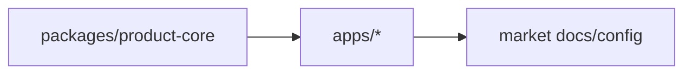

## 변경 요약

-

## 확인한 명령

- [ ] `pnpm run test:core`
- [ ] `pnpm run check:architecture`
- [ ] `pnpm run check:docs`

## 릴리스 영향

- [ ] Google Play 영향 없음 또는 `docs/05-markets/google-play.md` 갱신
- [ ] App Store 영향 없음 또는 `docs/05-markets/app-store.md` 갱신
- [ ] AppsInToss 영향 없음 또는 `docs/05-markets/apps-in-toss.md` 갱신
- [ ] Firebase 영향 없음 또는 `firebase/` / `docs/05-markets/firebase.md` 갱신

## 구조 변경이 있으면

