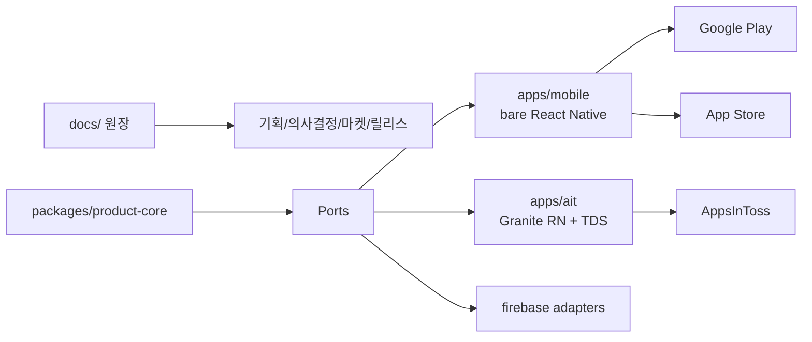

# Seorilabs App Template Agent Instructions

## 기본 원칙

- 한글을 주 사용언어로 한다.
- 항상 간결하고 실무적으로 답변한다.
- 애매한 부분은 상상해서 채우지 말고, 파일, 로그, 설정, 실행 결과를 먼저 확인한다.
- 사용자의 말이 사실과 다르거나 기술적으로 부정확하면 바로잡는다.
- 복잡한 구조 설명은 가능하면 Mermaid로 도식화한다.
- 로컬 PC에서 `docker build`가 필요하면 Docker Desktop보다 Colima 기반 Docker daemon/context를 우선 사용한다.
- 대화 중 장기 지식으로 남길 만한 확인 사실은 문서화한다. 단, 이 레포의 실행 원장은 `docs/`이고 Obsidian은 보조 지식베이스다.

## Source Of Truth

- 기획, 의사결정, 작업 로그, 마켓 정보, 릴리스 준비 상태의 원장은 `docs/`다.
- Obsidian에는 범용 지식, 운영 노하우, 다른 프로젝트에도 재사용할 수 있는 학습 내용을 보조 기록한다.
- 콘솔에서만 바뀐 값은 release-ready로 보지 않는다. Google Play, App Store, AppsInToss, Firebase 관련 값은 repo-local config 또는 `docs/05-markets/`에 남긴다.
- 새 프로젝트에서 확정해야 하는 값은 `확정 필요`로 남기고 임의로 채우지 않는다.

## Local Overrides

- `AGENTS.local.md` 또는 `AGENT.local.md`가 있으면 먼저 읽고, 개별 프로젝트 지침으로 적용한다.
- local agent 파일은 개인 환경, signing path, package name, bundle id, AppsInToss appName, console app id, runner 예외 등 프로젝트별/개인별 설정만 담는다.
- local agent 파일은 커밋하지 않는다. 예시는 `AGENTS.local.example.md`를 사용한다.

## Stack Decision

- 비게임 기본 스택은 React Native + Firebase다. Firebase가 필요 없는 MVP라면 추가하지 않는다.
- `apps/mobile`은 Google Play와 App Store를 위한 Community CLI 기반 bare React Native target이다.
- `apps/ait`은 AppsInToss Granite React Native target이다.
- AppsInToss 비게임 앱은 TDS React Native를 사용한다.
- Expo managed app은 이 템플릿의 기본값이 아니다. Store SDK, native Firebase, signing, Xcode/Gradle release 제어가 약해지면 bare RN을 유지한다.

## Clean Architecture

- `packages/product-core`에는 platform 독립 domain, value object, use case, port interface, pure fixture/test만 둔다.
- `packages/product-core`는 React Native, Expo, Firebase, AppsInToss, Toss, Google/Apple SDK, StoreKit, Play Billing, AdMob, native module, network client를 직접 import하지 않는다.
- UI, navigation, native lifecycle, permissions, storage, analytics, crash, ads, purchase, remote config 구현은 app target 또는 adapter에 둔다.
- app target은 composition root에서 core use case와 adapter를 연결한다.
- Firebase Admin SDK, service account, private key, privileged operation은 client app에 절대 포함하지 않는다.

## GitHub Actions / ARC

- Seorilabs GitHub Actions 또는 ARC runner 라우팅을 작성/수정/진단할 때는 `seorilabs-arc-runners` 스킬을 사용한다.
- 먼저 운영자 워크스페이스의 `kubectl/github-actions-runners/global-versions.yaml`을 확인한다.
- GitHub Actions action/module 버전은 GitHub 공식 repo/API 또는 공식 문서 기준 최신 stable major를 확인한다. `@latest`나 branch 참조보다 확인된 major tag를 선호한다.
- 현재 확인 기준: `actions/checkout@v6`, `actions/setup-node@v6`, `actions/setup-java@v5`, `actions/upload-artifact@v7`.
- private repo의 JS/TS lint/test/typecheck, docs check, AppsInToss candidate는 `seorilabs-rpi-arm64`를 우선 검토한다.
- ARM64/RPI Docker build는 `seorilabs-rpi-arm64-dind`를 사용한다.
- public PR 경로에는 Seorilabs private ARC runner를 노출하지 않는다. 템플릿 workflow는 `github.event.repository.private` 조건으로 fallback을 둔다.
- Android AAB/APK release build는 RPI ARC로 보내지 않는다. Android release는 x64 Linux runner를 사용한다.
- Apple App Store/Xcode build는 macOS/Xcode runner가 필요하므로 RPI ARC로 보내지 않는다.

## 테스트 레이어

- `pnpm run test:core`: product core 구조와 순수 테스트 확인.
- `pnpm run check:architecture`: core import boundary 확인.
- `pnpm run check:docs`: docs 원장 구조 확인.
- `pnpm run check:mobile`: `apps/mobile` native target 초기화 상태 확인.
- `pnpm run check:ait`: `apps/ait` Granite target 초기화 상태 확인.
- `pnpm run check:release`: Google Play, App Store, AppsInToss, Firebase, privacy, signing, asset blocker inventory. 템플릿 placeholder가 남아 있으면 실패하는 것이 정상이다.
- `pnpm run check:platform-sdk`: `@seorilabs/platform-sdk` exact 선언과 pnpm lockfile 해석 일치 확인.

## 의존성과 lockfile

- 이 저장소는 pnpm 하나로 설치한다. 루트 `packageManager` 필드와 `pnpm-lock.yaml`만 package manager 신호로 남기고 `package-lock.json`, `yarn.lock`, `bun.lock*`을 커밋하지 않는다. lockfile이 두 벌이면 Seorilabs Platform discovery의 package manager 감지가 AMBIGUOUS로 빠진다.
- `@seorilabs/platform-sdk`는 `apps/mobile`과 `apps/ait` 양쪽에서 캐럿·틸드 없이 exact 버전으로 선언하고, 두 target이 같은 버전을 쓴다. 기준값은 `scripts/check-platform-sdk-lock.mjs`의 `APPROVED_SDK_VERSION`이며, Platform release가 새 artifact를 승인할 때만 lockfile과 함께 옮긴다.
- Platform discovery는 선언이 exact이고 lockfile이 **같은 exact 버전**으로 해석될 때만 `integration=SDK`로 분류한다. 둘 중 하나라도 어긋나면 `CUSTOM_HTTP`가 된다. 이름과 달리 `CUSTOM_HTTP`는 raw HTTP 호출을 뜻하지 않고 의존성이 고정·해석되지 않았다는 뜻이다.
- SDK는 npm 공개 레지스트리에서 받는다. lockfile resolution에 사설 레지스트리 tarball을 되살리지 않는다. 되살리면 토큰 없는 CI와 자율 실행이 다시 설치에 실패한다.
- CI와 로컬 설치는 모두 `pnpm install --frozen-lockfile`을 쓴다. 워크플로우가 활성화하는 pnpm 버전은 루트 `packageManager`와 같게 유지한다.

## 배포 게이트

- Planning approval 전에는 제품 코드, store registration, Firebase project, package/bundle id를 확정하지 않는다.
- Deployment approval 전에는 store submission, production track promotion, AppsInToss production release를 하지 않는다.
- 네이티브 런치/스플래시 화면은 release asset으로 본다. iOS `LaunchScreen.storyboard`, Android launch theme/splash, AppsInToss 최초 route에서 React Native/프레임워크 템플릿 문구나 기술 target name을 노출하지 않는다.
- iOS 런치 화면을 없애려고 `UILaunchStoryboardName`을 지우지 않는다. 제품 로고/앱 이름 중심의 정적 화면으로 교체하고, 필요하면 `react-native-bootsplash` 같은 hold mechanism으로 초기 RN 렌더 전환을 맞춘다.
- `.ait` 생성 성공은 AppsInToss 콘솔 등록, 이미지, 광고, sandbox QA 완료를 의미하지 않는다.
- Android AAB 생성 성공은 Play Console data safety, signing, internal testing, review note 완료를 의미하지 않는다.
- iOS archive/export 성공은 App Store Connect privacy, age rating, review note, export compliance 완료를 의미하지 않는다.

## Git / PR

- GitHub PR 제목과 Description은 한글로 작성한다. 고유명사, 명령어, 코드, 에러 메시지는 원문 유지 가능하다.
- PR Description에 구조나 흐름 이해가 필요하면 Mermaid 다이어그램을 포함한다.
- Copilot Review는 보정 커밋 이후 명시적으로 re-request해야 한다.
- 사용자 변경은 되돌리지 않는다. 관련 없는 dirty worktree는 무시하고, 충돌하는 경우 먼저 확인한다.
