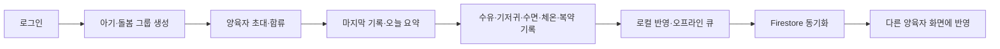

# BabyCare Product Spec

## 승인과 원장

| 항목 | 값 |
| --- | --- |
| Lifecycle state | `build` |
| Planning approval | `approved` — 2026-07-12 |
| Deployment approval | `approved` — 2026-08-09 Google Play·App Store 잔여 blocker 처리와 EU 포함 전국가 출시, Apple DSA trader 확정 |
| 분류 / 기본 스택 | non-game / bare React Native + Firebase |
| 출시 타깃 | Google Play / App Store / AppsInToss |
| 기획 출처 | Obsidian `프로젝트/개인/babycare/01 기획서` |
| 실행 source of truth | 이 repo의 `docs/` |

기획 승인으로 제품 구현과 QA를 진행했고, 2026-08-09 사용자가 Google Play·App Store의 잔여 blocker 처리와 EU 포함 전국가 출시를 승인하고 Apple DSA status를 trader로 확정했다.

## 제품 정의

- 한 줄 가치: 여러 양육자가 한 아기의 돌봄 기록을 실시간으로 함께 남기고 확인한다.
- 주요 사용자: 신생아~영유아를 교대로 돌보는 성인 부모, 조부모, 베이비시터와 보육교사.
- 해결할 문제: 로컬 한 기기에 고립된 기록, 구두·메신저에 흩어진 인수인계, 밤중 한 손 입력의 마찰, 기기 교체 시 데이터 소실.
- 제품 성격: 성인 양육자용 기록·공유 도구. 의료 진단·처방·치료 판단을 제공하지 않는다.
- 핵심 원칙: 공동 기록을 1급 기능으로, 자주 쓰는 입력은 5~15초 안에, 기록은 오프라인에서도 시작할 수 있게, 아동 데이터는 초대된 그룹 내부에만 둔다.

## 제품 식별자

후보를 확정값처럼 사용하지 않는다. Android application ID와 iOS bundle ID는 사용자가 확정한 `com.seorilabs.babycare`를 Debug/Release에 공통 사용한다.

| 항목 | 현재 값 | 상태 |
| --- | --- | --- |
| app id | `babycare` | repo 내부 식별자 |
| 현재 native target name | `BabyCare` | 개발용 기술 이름 |
| 한국어 앱 이름 | `함께봄` | 2026-07-18 사용자 확정 |
| 영어 앱 이름 | `BabyNest` | 2026-07-18 사용자 확정 |
| Android application ID | `com.seorilabs.babycare` | 2026-07-13 사용자 확정 |
| iOS bundle ID | `com.seorilabs.babycare` | 2026-07-13 사용자 확정 |
| AppsInToss `appName` | `babynest` | Console 승인·readback 완료, 2026-08-04 |
| 대표 색상 | `#5FB49C` | 2026-07-18 사용자 확정 |
| 고객지원 이메일 | `cs@seorilabs.com` | 해당 마켓에 사용 |

## MVP 범위

### In

1. 성인 양육자 계정 생성/로그인.
2. 아기 1명과 돌봄 그룹 생성, 소유자가 다른 양육자를 코드/링크로 초대하고 상대가 합류.
3. 수유(모유 좌·우 타이머, 유축·분유·이유식 양), 기저귀(소변·대변·혼합), 수면(낮잠·밤잠 시작/종료), 체온(섭씨·측정부위), 복약(약 이름·주성분·실제 투여량·사용자 확인 간격) 기록.
4. 홈에서 마지막 수유·기저귀·수면·체온·복약과 오늘 요약 확인.
5. 기록자와 시각이 보이는 타임라인, 본인 기록 soft delete, 수유·수면·기저귀 기본 통계.
6. 두 명 이상의 양육자 기기 사이 Firestore 실시간 공동 기록.
7. 오프라인 기록, 앱 재시작 후 보존, 온라인 복귀 시 동기화와 실패/재시도 상태.
8. 그룹 멤버십 기반 Firestore/Storage 접근 통제와 멤버 제거 시 새 요청 차단.
9. 시스템 다크모드, 작은 화면과 한 손 조작, 제품 브랜딩 native launch 화면.
10. Google Play/App Store mobile target과 AppsInToss target에서 동일한 핵심 기록·확인 흐름.

### Out

- 성장·백분위, 증상, 예방접종, 목욕·활동·발달, 사진·자유 일지.
- FCM 리마인더와 다른 양육자 기록 알림.
- 다둥이·수정월령, CSV/PDF 내보내기와 데이터 리포트.
- 구독·결제, 광고, 유료 기능 경계. (수익화 방향은 ADR 0004에서 확정 — v1 무료, 출시 후 통계 상세에 보상형 광고 1개. `docs/04-work/backlog.md` P2 참고)
- 위젯, Apple Watch/Wear OS, 음성 입력, 자장가, 적응형 수면 예측.
- 공개 SNS/커뮤니티, 위치 추적, 커머스, 원격진료와 의료 판정.
- 레거시 Realm 데이터 자동 마이그레이션. 사용자 규모 확인 후 별도 결정한다.

Out 항목을 구현 범위에 넣으려면 다음 planning approval 대상으로 다시 검토한다. 개인정보 보호를 위한 계정 삭제·데이터 완전 삭제·기본 내보내기 의무는 유료 제품 기능과 별개로 release blocker에서 다룬다.

## 핵심 흐름

초대는 client가 `invites` 문서를 직접 읽거나 쓰지 않고 privileged server transaction이 발급·만료·1회 사용·합류를 처리한다.

## 기능 요구사항

| ID | 요구사항 | MVP 완료 증거 |
| --- | --- | --- |
| FR-01 | 계정과 그룹 멤버십으로 사용자·권한을 식별한다. | 실제 Auth 계정 2개로 owner/member 시나리오 통과 |
| FR-02 | 수유·기저귀·수면·체온·복약을 현재/과거 시각으로 기록한다. 복약 용량은 추천하지 않고 사용자 확인 간격과 성분 중복 경고를 제공한다. | core/Rules 테스트 + Android/iOS/AIT 입력 smoke |
| FR-03 | 진행 중 수면을 다른 그룹 멤버도 종료할 수 있고 원 기록 identity는 보존한다. | core/Rules 회귀 테스트 + 두 기기 QA |
| FR-04 | 홈·타임라인·기본 통계가 soft-deleted 기록을 제외하고 일관된 값을 보인다. | core 집계 테스트 + UI smoke |
| FR-05 | 기록이 로컬에 즉시 보이고 재연결 후 한 번만 서버에 반영된다. | 비행기 모드→재실행→재연결 QA |
| FR-06 | A의 기록이 B 기기에 실시간 반영되고 기록자가 표시된다. | 서로 다른 계정·기기 2대 QA |
| FR-07 | 비멤버와 제거된 멤버는 그룹 데이터와 사진의 새 요청에 접근할 수 없다. | Firebase Emulator + 실제 비프로덕션 project 검증 |
| FR-08 | 소유자만 초대·멤버 제거·그룹 관리 작업을 수행한다. | Functions/Rules 테스트 + UI 권한 QA |

## 비기능·보안 요구사항

- `packages/product-core`는 디바이스, 네트워크, Firebase emulator 없이 테스트 가능해야 한다.
- core에는 React Native, Firebase, AppsInToss, Google/Apple SDK와 native module import를 두지 않는다.
- 아기 이름·생년월일·사진 경로·기록 값·메모는 Analytics/Crashlytics에 보내지 않는다. 이벤트 type 등 allowlist만 보낸다.
- 민감 데이터는 초대된 그룹 내부에만 보이고 공개 download token URL을 저장하지 않는다.
- service account, private key, Firebase Admin SDK는 client app에 포함하지 않는다.
- 멤버 제거·로그아웃·계정 삭제 시 로컬 캐시 purge 경로를 검증한다.
- 체온·복약을 포함한 건강 기록은 참고 정보로만 표시하고 의료 판단 표현이나 용량 추천을 사용하지 않는다. 복약 안전 경계는 ADR 0006을 따른다.

상세 위협과 통제는 [Security Threat Model](../03-architecture/security-threat-model.md)을 따른다.

## 현재 구현 기준선

| 영역 | 현재 구현 | MVP까지 남은 핵심 |
| --- | --- | --- |
| product core | `Baby`, `CareGroup`, `Membership`, `CareGroupInvite`, 수유·기저귀·수면·체온·복약 `CareEvent`; 복약 간격 확인, 기록·수면종료·soft delete·대시보드 use case; Auth/그룹/아기/초대/기록·remote mutation·string storage port | 실제 non-production project와 기기 2대에서 전체 use-case 검증 |
| mobile | 기본 개발 실행 경로에 Firebase composition root를 연결했다. native Firebase app이 없으면 `demo-babycare` Emulator에 Auth/Firestore/Functions를 연결하며, 개발용 익명 인증, owner 그룹·아기 생성, 6자리 초대 발급·합류 UI, UID-scoped cloud context cache, 실시간 Home/Timeline/Stats feed, 동기화 상태·재시도 배너와 멤버 목록을 제공한다. Firebase 초기화 오류는 fail-closed 재시도 화면으로 처리하고 local preview는 Jest에서만 사용한다. | 실제 Firebase client config와 Functions region, production Auth provider·계정 복구/삭제, 실제 기기 2대의 초대·offline/restart/reconnect·권한 회수 QA |
| Firebase | Rules/Functions의 payload-bound mutation receipt와 baby별 active-sleep singleton lock을 검증한다. 별도 mobile shared-flow 테스트는 Auth Emulator의 익명 사용자 2명으로 owner 생성→초대 발급/수락→member 실시간 기록 수신→멤버 제거 후 접근 거부를 통과한다. | 실제 non-production project, App Check·Secret Manager·IAM·client config 통합 검증. Emulator의 두 client는 실제 기기 2대 증거가 아님 |
| AppsInToss | Granite RN·TDS UI, `Storage` session, Platform custom-token/Firebase Auth REST, Firestore REST 기록·조회, callable 초대·삭제 adapter를 연결했다. 운영 두 계정 E2E를 통과한 `main@707df10` 후보를 비공개 deployment로 업로드했다. | 실제 sandbox에서 Storage·재실행·네트워크 복귀 QA, App Check/edge 보호, 실제 AIT 화면 screenshot |
| release | 3마켓 식별자·자산·메타데이터 원장을 구성했고 Play internal·TestFlight `1.0.9`, AppsInToss 비공개 후보까지 업로드했다. Google Play·App Store의 EU 포함 전국가 출시와 trader를 확정했다. | `v1.1.1` 실제 계정·기기 QA, Apple App Privacy·DSA·availability, 심사·공개 readback |

RNFirebase adapter와 Firebase 개발 composition이 연결됐지만 production composition이 검증된 것은 아니다. `demo-babycare` Emulator의 익명 사용자 2명 테스트는 client·Rules·Functions 계약을 검증하는 로컬 증거이며, 실제 프로젝트의 App Check/IAM, production 인증, 클라우드 보존, 실제 기기 2대 공동 기록 완료 증거로 사용하지 않는다.

## MVP 완료 기준

- `pnpm run test`, `pnpm run check:mobile`, `pnpm run check:ait`가 통과한다.
- 실제 비프로덕션 Firebase에서 Auth, Firestore, Storage, Functions, App Check 경계를 통합 검증한다.
- 서로 다른 계정과 기기 2대에서 초대→합류→실시간 기록→오프라인 복귀→멤버 제거 흐름을 통과한다.
- Android/iOS/AIT에서 수유·기저귀·수면·체온·복약의 입력·홈·타임라인이 동등하게 동작하고 기존 기본 통계가 유지된다.
- native cold start에서 framework/template 문구가 노출되지 않는다.
- privacy/data safety, 계정 삭제·export, signing, 스토어 자산과 review note blocker가 repo 원장에 반영된다.
- release candidate는 승인된 EU 포함 전국가와 Apple trader 범위에서 제출하고 정책 답변은 실제 SDK·기능 근거와 일치시킨다.
