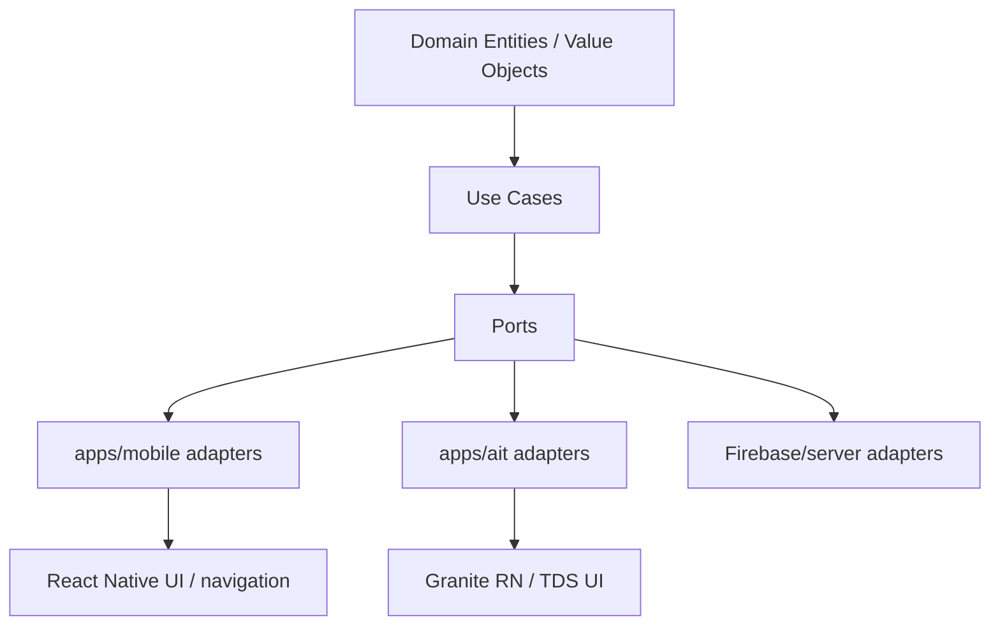

# Clean Architecture Boundary

## Dependency Rule

의존성 방향은 바깥에서 안쪽으로만 향한다. `product-core`는 app target이나 SDK를 모른다.

## packages/product-core

허용:

- Domain entities
- Value objects
- Pure use cases
- Port interfaces
- Pure fixtures/fakes

금지:

- React Native, Expo, native module
- Firebase SDK, Admin SDK, service account
- AppsInToss, Granite, Toss SDK
- Google Play Billing, App Store StoreKit
- Ad SDK
- Network/client SDK 직접 호출

## apps/mobile

허용:

- Android/iOS native project
- React Native UI, navigation, lifecycle
- Native Firebase adapter
- Play Billing / StoreKit adapter
- Analytics, Crashlytics, FCM, App Check adapter
- Platform storage, permission, device API adapter

## apps/ait

허용:

- Granite React Native runtime
- TDS React Native UI
- AppsInToss `Storage` 등 runtime API adapter
- AIT-safe server API adapter

주의:

- normal RN native module이 Toss runtime에서 동작한다고 가정하지 않는다.
- Firebase native module, OAuth redirect, realtime listener, FCM, file upload는 device-level AppsInToss 검증 전까지 release-ready로 보지 않는다.

## Market / Backend

- Google Play: `play-store/`
- App Store: `app-store/`
- AppsInToss: `apps-in-toss/`, `apps/ait/`
- Firebase: `firebase/`
