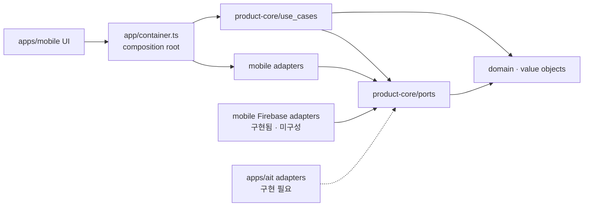

# Clean Architecture Boundary

## Dependency Rule

코드 의존성은 app delivery layer에서 core 안쪽으로만 향한다. core는 app target과 SDK를 모르고, app composition root가 port 구현을 선택한다.



화살표는 import/구성 의존성을 뜻한다. Firestore 문서나 RN component가 core 타입을 직접 지배하지 않으며, adapter가 외부 표현과 core domain을 변환한다.

## 현재 모듈

### `packages/product-core`

| Layer | 현재 코드 |
| --- | --- |
| Domain | `Baby`, `CareGroup`, `Membership`, `CareGroupInvite`, branded ID, 수유·기저귀·수면 `CareEvent`와 validation |
| Value objects | 시간 경과, ml/oz 변환 |
| Use cases | 기록 생성, 수면 세션 종료, 본인 기록 soft delete, 홈/통계 집계 |
| Ports | `AuthPort`, `CareGroupRepositoryPort`, `BabyRepositoryPort`, `InviteServicePort`, `CareEventRepositoryPort`, `AnalyticsPort`, `ClockPort`, `IdGeneratorPort` |
| Test support | in-memory repository와 순수 Node 테스트 |

core에 허용하는 것은 domain entity/value object, 순수 use case, port interface, 순수 fixture/fake뿐이다. runtime dependency도 두지 않는다.

금지:

- React Native, Expo, component/navigation/native module
- Firebase client/Admin SDK, Firestore, service account/private key
- AppsInToss, Granite, TDS와 Toss runtime API
- Google/Apple SDK, Play Billing, StoreKit, AdMob
- AsyncStorage, network client, state-management framework

### `apps/mobile`

현재 composition root는 `apps/mobile/src/app/container.ts`다.

| 역할 | 구현 |
| --- | --- |
| Care event 저장 | `PersistentCareEventRepository` — AsyncStorage 기반 개발 adapter |
| Local onboarding/session | `LocalSessionRepository` — 앱 전용 개발 session |
| ID | `NativeIdGenerator` |
| Clock | `Date.now()` adapter |
| Analytics | Firebase 등록 전 no-op adapter |
| Delivery | `App.tsx`, screens, components |
| Firebase transport | Auth, 그룹·멤버십, 아기, 돌봄 기록, invite callable adapter와 외부 문서 decoder |

이 구성은 로컬 UX 세로 슬라이스용이다. RNFirebase adapter들은 구현되어 있지만 `app/container.ts`에서 선택되지 않고 실제 Firebase project/client config도 없다. 따라서 AsyncStorage 화면의 임의 local session과 초대 코드 미리보기는 production Auth, Functions callable, Firestore offline/realtime 흐름의 완료 증거가 아니다.

Firebase 연결 시 `CareEventRepositoryPort` 구현을 교체하고 core use case는 유지한다. Auth/session/navigation, 동기화 상태, permissions와 native lifecycle은 mobile app layer에 둔다.

### `apps/ait`

정책 적합성과 영구 `appName` 확정 전이라 아직 초기화하지 않았다. 생성 후 Granite RN + TDS UI, AppsInToss `Storage`, 인증/server API adapter를 둔다. mobile native Firebase module을 그대로 재사용할 수 있다고 가정하지 않는다.

### `firebase`

- client-accessed Firestore/Storage 권한은 version-controlled Security Rules로 제한한다.
- 초대 발급·수락, 소유권 이전, 완전 삭제·export처럼 privileged한 동작만 server/Functions에서 수행한다.
- Admin SDK, service account와 private key는 `apps/mobile`, `apps/ait`, `packages/product-core`에 포함하지 않는다.
- mobile client adapter는 `apps/mobile/src/adapters/firebase/`에서 core port를 구현한다. 실제 project와 production composition 연결은 아직 하지 않았다. Rules가 adapter validation을 대체하지 않고, UI 숨김이 Rules를 대체하지 않는다.

## Port 확장 기준

MVP에 필요한 외부 기능만 port로 추가한다.

| Capability | Core contract 후보 | 구현 위치 |
| --- | --- | --- |
| 인증/session | `AuthPort` + app-level session contract | mobile Firebase Auth adapter 구현, provider/composition 미확정 / AIT auth bridge |
| 그룹·아기 | `CareGroupRepositoryPort`, `BabyRepositoryPort` | mobile Firestore adapter 구현 / AIT adapter 미구현 |
| 초대 | `InviteServicePort` | client adapter → privileged Functions |
| 돌봄 기록 | `CareEventRepositoryPort` | AsyncStorage 개발 adapter. 화면이 기다리는 local durable write 계약 |
| 원격 기록 transport | `CareEventRemoteStorePort` | mobile Firestore adapter. server acknowledgement 계약이며 화면 repository로 직접 구성 금지 |
| 분석 | 기존 `AnalyticsPort` | PII-free Firebase/AIT analytics adapter |
| 시간·ID | 기존 `ClockPort`, `IdGeneratorPort` | target별 system adapter |

알림, 이미지, remote config, 결제와 export는 MVP 밖이다. 실제 use case가 승인되기 전에 추상화만 미리 추가하지 않는다.

## 데이터·동기화 규칙

- 저장 canonical 단위는 volume `ml`, 시간 Unix epoch millisecond다.
- event identity(`id`, `groupId`, `babyId`, `caregiverId`, `kind`, `createdAt`)는 생성 후 바꾸지 않는다.
- 수정은 `revision`을 단조 증가시키고 client hard delete/undelete를 허용하지 않는다.
- 다른 그룹 멤버는 active sleep의 close-only 전이만 수행할 수 있다.
- 현재 use case의 active sleep 중복 방지는 한 process 안의 로컬 기록을 직렬화한다. 서로 다른 기기의 동시 시작 단일성은 atomic server-side 경로를 구현·검증하기 전까지 보장하지 않는다.
- 오프라인 기록은 local durable repository와 outbox에 먼저 반영한 뒤 동일 event ID로 원격 재시도해 중복을 방지한다. Firestore `setDoc` promise를 화면 저장 완료 신호로 직접 사용하지 않는다. pending/failed/synced 상태, 재시작, 충돌·재시도 정책은 local-first coordinator와 실제 adapter 테스트로 증명한다.
- Analytics에는 event type 같은 allowlist만 보내고 기록 값·메모·아기 식별자는 보내지 않는다.

보안 불변식과 server cleanup은 [Security Threat Model](security-threat-model.md)을 따른다.

## Architecture Gate

```bash
pnpm run test:core
pnpm run check:architecture
```

`check:architecture`는 `packages/product-core/src`와 순수 테스트에서 RN/Firebase/AIT/native/network import를 탐지하고, core runtime dependency가 있으면 실패한다. adapter 계약 자체의 행동은 core fake와 target별 integration test로 별도 검증한다.
