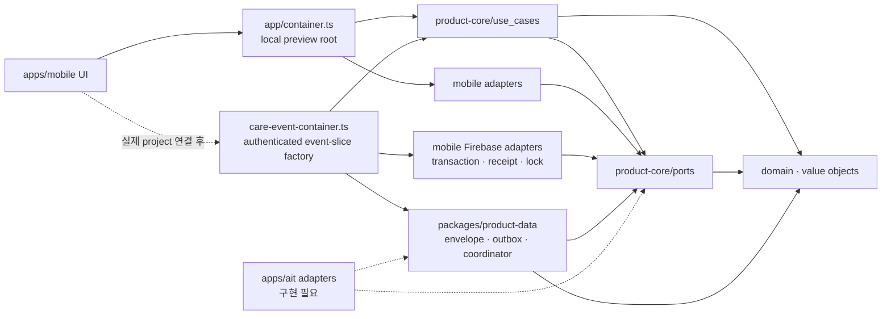

# Clean Architecture Boundary

## Dependency Rule

코드 의존성은 app delivery layer에서 core 안쪽으로만 향한다. core는 app target과 SDK를 모르고, app composition root가 port 구현을 선택한다.



화살표는 import/구성 의존성을 뜻한다. Firestore 문서나 RN component가 core 타입을 직접 지배하지 않으며, adapter가 외부 표현과 core domain을 변환한다.

## 현재 모듈

### `packages/product-core`

| Layer | 현재 코드 |
| --- | --- |
| Domain | `Baby`, `CareGroup`, `Membership`, `CareGroupInvite`, branded ID, 수유·기저귀·수면 `CareEvent`와 validation |
| Value objects | 시간 경과, ml/oz 변환 |
| Use cases | 기록 생성, 수면 세션 종료, 본인 기록 soft delete, 홈/통계 집계 |
| Ports | `AuthPort`, `CareGroupRepositoryPort`, `BabyRepositoryPort`, `InviteServicePort`, `CareEventRepositoryPort`, `CareEventRemoteStorePort`, `StringStoragePort`, `AnalyticsPort`, `ClockPort`, `IdGeneratorPort` |
| Test support | in-memory repository와 순수 Node 테스트 |

core에 허용하는 것은 domain entity/value object, 순수 use case, port interface, 순수 fixture/fake뿐이다. runtime dependency도 두지 않는다.

금지:

- React Native, Expo, component/navigation/native module
- Firebase client/Admin SDK, Firestore, service account/private key
- AppsInToss, Granite, TDS와 Toss runtime API
- Google/Apple SDK, Play Billing, StoreKit, AdMob
- AsyncStorage, network client, state-management framework

### `packages/product-data`

target 공용 local-first 데이터 정책을 둔다. `CareEvent` codec/revision·payload fingerprint, 인증 user/group/baby scoped 단일 envelope, revision별 outbox와 remote drain/reconcile가 여기 속한다. `StringStoragePort`와 product-core port에만 의존하며 React Native, AsyncStorage, Firebase, AppsInToss SDK를 직접 import하지 않는다.

동일 storage instance와 scope에는 store 1개만 열 수 있다. purge는 store를 먼저 닫아 새 write를 차단하고 기존 serialized queue의 마지막에서 empty-write/remove를 수행한다. remote observer와 in-flight push는 repository generation으로 무효화해 권한 회수 뒤 cache를 다시 만들지 못하게 한다.

### `apps/mobile`

로컬 preview composition root는 `apps/mobile/src/app/container.ts`다. `apps/mobile/src/app/care-event-container.ts`는 이미 해석된 인증 context와 remote port를 주입받는 event-slice factory이며, Firebase adapter/Auth/session/navigation까지 만드는 production composition root는 아직 없다.

| 역할 | 구현 |
| --- | --- |
| Care event 저장 | `PersistentCareEventRepository` — AsyncStorage 기반 개발 adapter |
| Local onboarding/session | `LocalSessionRepository` — 앱 전용 개발 session |
| ID | `NativeIdGenerator` |
| Clock | `Date.now()` adapter |
| Analytics | Firebase 등록 전 no-op adapter |
| Delivery | `App.tsx`, screens, components |
| Firebase transport | Auth, 그룹·멤버십, 아기, 돌봄 기록 transaction, invite callable adapter와 외부 문서 decoder |
| Cloud sync factory | 인증 context 검증, `product-data` store/coordinator, sync status, Auth/membership 확인형 cache purge lifecycle |

기본 `app/container.ts` 구성은 로컬 UX 세로 슬라이스용이다. `care-event-container.ts`는 인증 identity·membership·group·baby가 일치할 때만 별도의 scoped cloud store를 만들며 local preview key를 가져오지 않는다. 실제 Firebase project/client config와 production Auth provider가 없으므로 아직 기본 실행 경로로 선택하지 않는다.

Firebase 연결 시 `CareEventRepositoryPort` 구현을 교체하고 core use case는 유지한다. Auth/session/navigation, 동기화 상태, permissions와 native lifecycle은 mobile app layer에 둔다.

### `apps/ait`

정책 적합성과 영구 `appName` 확정 전이라 아직 초기화하지 않았다. 생성 후 Granite RN + TDS UI, AppsInToss `Storage`, 인증/server API adapter를 둔다. mobile native Firebase module을 그대로 재사용할 수 있다고 가정하지 않는다.

### `firebase`

- client-accessed Firestore/Storage 권한은 version-controlled Security Rules로 제한한다.
- 초대 발급·수락, 소유권 이전, 완전 삭제·export처럼 privileged한 동작만 server/Functions에서 수행한다.
- Admin SDK, service account와 private key는 `apps/mobile`, `apps/ait`, `packages/product-core`에 포함하지 않는다.
- mobile client adapter는 `apps/mobile/src/adapters/firebase/`에서 core port를 구현한다. 실제 project와 production composition 연결은 아직 하지 않았다. Rules가 adapter validation을 대체하지 않고, UI 숨김이 Rules를 대체하지 않는다.

## Port 확장 기준

MVP에 필요한 외부 기능만 port로 추가한다.

| Capability | Core contract 후보 | 구현 위치 |
| --- | --- | --- |
| 인증/session | `AuthPort` + app-level session contract | mobile Firebase Auth adapter 구현, provider/composition 미확정 / AIT auth bridge |
| 그룹·아기 | `CareGroupRepositoryPort`, `BabyRepositoryPort` | mobile Firestore adapter 구현 / AIT adapter 미구현 |
| 초대 | `InviteServicePort` | client adapter → privileged Functions |
| 돌봄 기록 | `CareEventRepositoryPort` | AsyncStorage 개발 adapter. 화면이 기다리는 local durable write 계약 |
| 원격 기록 transport | `CareEventRemoteStorePort` | revision mutation/result/error/server snapshot 계약. transaction receipt와 active-sleep lock을 쓰며 화면 repository로 직접 구성 금지 |
| 문자열 저장 | `StringStoragePort` | mobile AsyncStorage / 향후 AIT Storage. sync store에 주입하며 core는 SDK를 모름 |
| 분석 | 기존 `AnalyticsPort` | PII-free Firebase/AIT analytics adapter |
| 시간·ID | 기존 `ClockPort`, `IdGeneratorPort` | target별 system adapter |

알림, 이미지, remote config, 결제와 export는 MVP 밖이다. 실제 use case가 승인되기 전에 추상화만 미리 추가하지 않는다.

## 데이터·동기화 규칙

- 저장 canonical 단위는 volume `ml`, 시간 Unix epoch millisecond다.
- event identity(`id`, `groupId`, `babyId`, `caregiverId`, `kind`, `createdAt`)는 생성 후 바꾸지 않는다.
- 수정은 `revision`을 단조 증가시키고 client hard delete/undelete를 허용하지 않는다.
- 다른 그룹 멤버는 active sleep의 close-only 전이만 수행할 수 있다.
- 로컬 event와 revision별 outbox mutation은 인증 user/group/baby별 단일 JSON envelope에 한 번의 serialized write로 커밋한다. persist 실패 시 memory/observer도 rollback하며 local preview cache를 cloud scope로 자동 이관하지 않는다.
- UI 저장은 local envelope commit까지만 기다린다. coordinator는 `rev1 → rev2`를 합치지 않고 순서대로 전송한다. retryable 실패는 재연결 server snapshot 또는 명시적 retry에서, unauthenticated 실패는 강제 Auth 검증 성공이나 이후 server-confirmed snapshot에서 다시 시도한다.
- Firestore transaction은 canonical payload SHA-256으로 이름 붙인 immutable mutation receipt를 event revision과 원자 기록한다. Rules는 path의 event ID·revision·hash 형식뿐 아니라 receipt의 전체 transport payload가 같은 write의 event map과 일치하는지 양방향 검증한다. adapter는 receipt payload를 canonical domain event·actor와 다시 대조한다.
- active sleep 시작은 `activeSleeps/{babyId}` singleton lock과 event를 같은 transaction에 만들고, 종료·active soft delete는 lock을 함께 제거한다. Rules Emulator 경쟁 테스트에서 동시 시작 2건 중 정확히 1건만 성공한다.
- 원격 cache/pending snapshot과 listener error를 실제 빈 server snapshot으로 취급하지 않는다. `fromCache=false`, `hasPendingWrites=false`인 snapshot만 reconcile한다.
- cursor-aware page reconciliation 전에는 remote listener가 baby 전체 event feed를 관찰한다. 화면의 local filter/limit를 remote snapshot에 적용하면 다른 기기에서 범위 밖으로 이동한 기록이 stale projection으로 남기 때문이다. 장기 계정의 bounded pagination은 Firebase 기본 composition 전 backlog다.
- sign-out·identity 변경·membership 제거가 확인되면 observer를 먼저 중단하고 scoped cache를 purge한 뒤 revoked UI state를 통지한다. permission listener 오류의 membership 재확인은 native cache가 아닌 server-only query를 사용한다. 실제 RNFirebase composition에서는 native disk persistence를 끄고 custom envelope를 유일한 durable queue로 사용해야 한다.
- 정상 UI teardown은 event sync를 `quiesce()`하고 pending Auth/membership 검증을 drain한 뒤 store를 `close()`해 cache는 보존하고 single-writer claim만 해제한다. revocation `clear()`와 경쟁하면 privacy purge가 우선되며, 완료된 close 뒤 purge도 scoped claim을 다시 획득해야 한다. revocation과 정상 unmount를 같은 동작으로 취급하지 않는다.
- Analytics에는 event type 같은 allowlist만 보내고 기록 값·메모·아기 식별자는 보내지 않는다.

보안 불변식과 server cleanup은 [Security Threat Model](security-threat-model.md)을 따른다.

## Architecture Gate

```bash
pnpm run test:core
pnpm run check:architecture
```

`check:architecture`는 `packages/product-core/src`와 `packages/product-data/src`에서 RN/Firebase/AIT/native import를 탐지한다. core runtime dependency 또는 product-data의 product-core 외 runtime dependency가 있으면 실패한다. adapter 계약 자체의 행동은 core fake와 target별 integration test로 별도 검증한다.
