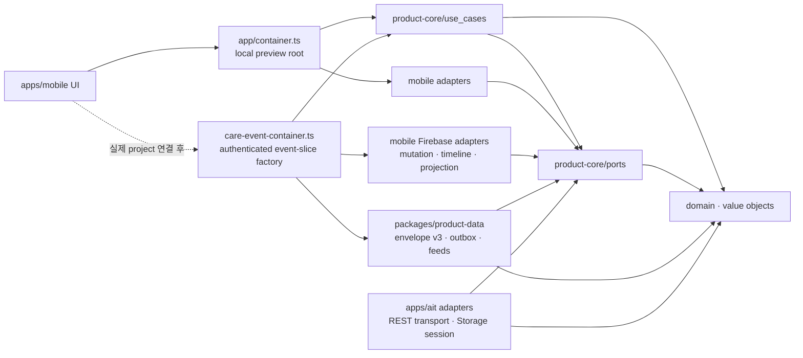

# Clean Architecture Boundary

## Dependency Rule

코드 의존성은 app delivery layer에서 core 안쪽으로만 향한다. core는 app target과 SDK를 모르고, app composition root가 port 구현을 선택한다.



화살표는 import/구성 의존성을 뜻한다. Firestore 문서나 RN component가 core 타입을 직접 지배하지 않으며, adapter가 외부 표현과 core domain을 변환한다.

## 현재 모듈

### `packages/product-core`

| Layer | 현재 코드 |
| --- | --- |
| Domain | `Baby`, `CareGroup`, `Membership`, `CareGroupInvite`, branded ID, 수유·기저귀·수면·체온·복약 `CareEvent`와 validation |
| Value objects | 시간 경과, ml/oz 변환 |
| Use cases | 기록 생성, 수면 세션 종료, 본인 기록 soft delete, 홈 집계와 caller-defined range 통계 집계 |
| Ports | `AuthPort`, `CareGroupRepositoryPort`, `BabyRepositoryPort`, `InviteServicePort`, `CareEventRepositoryPort`, `CareEventRemoteStorePort`, `CareEventProjectionRemotePort`, `StringStoragePort`, `AnalyticsPort`, `ClockPort`, `IdGeneratorPort` |
| Test support | in-memory repository와 순수 Node 테스트 |

core에 허용하는 것은 domain entity/value object, 순수 use case, port interface, 순수 fixture/fake뿐이다. runtime dependency도 두지 않는다.

금지:

- React Native, Expo, component/navigation/native module
- Firebase client/Admin SDK, Firestore, service account/private key
- AppsInToss, Granite, TDS와 Toss runtime API
- Google/Apple SDK, Play Billing, StoreKit, AdMob
- AsyncStorage, network client, state-management framework

### `packages/product-data`

target 공용 local-first 데이터 정책을 둔다. `CareEvent` codec/revision·payload fingerprint, 인증 user/group/baby scoped 단일 envelope v3, revision별 outbox와 remote drain/reconcile가 여기 속한다. v3는 bounded timeline coverage와 별도로 Home/Stats용 `overviewEventIds`, active sleep의 `unknown | confirmed_none | active(eventId)` named coverage를 저장한다. `CareEventOverviewFeed`는 기간 window, 종류별 latest와 active singleton을 결합하고 overview+active를 한 번의 `replaceRemoteProjections` commit으로 교체한다. `StringStoragePort`와 product-core port에만 의존하며 React Native, AsyncStorage, Firebase, AppsInToss SDK를 직접 import하지 않는다.

동일 storage instance와 scope에는 store 1개만 열 수 있다. purge는 store를 먼저 닫아 새 write를 차단하고 기존 serialized queue의 마지막에서 empty-write/remove를 수행한다. remote observer와 in-flight push는 repository generation으로 무효화해 권한 회수 뒤 cache를 다시 만들지 못하게 한다.

### `apps/mobile`

로컬 preview composition root는 `apps/mobile/src/app/container.ts`다. `apps/mobile/src/app/care-event-container.ts`는 이미 해석된 인증 context와 remote port를 주입받는 event-slice factory이며, Firebase adapter/Auth/session/navigation까지 만드는 production composition root는 아직 없다.

| 역할 | 구현 |
| --- | --- |
| Care event 저장 | `PersistentCareEventRepository` — AsyncStorage 기반 개발 adapter |
| Local onboarding/session | `LocalSessionRepository` — 앱 전용 개발 session |
| ID | `NativeIdGenerator` |
| Clock | `Date.now()` adapter |
| Analytics | Firebase 등록 전 no-op adapter |
| Delivery | `App.tsx`, screens, components |
| Firebase transport | Auth, 그룹·멤버십, 아기, 돌봄 기록 transaction, server-only timeline/window/latest/active singleton, invite callable adapter와 외부 문서 decoder |
| Cloud sync factory | 인증 context 검증, `product-data` store/coordinator, timeline+overview 단일 owner, sync status, Auth/membership 확인형 cache purge lifecycle |

`app/container.ts` 구성은 Jest local preview용이다. 실제 앱은 native Firebase 공동 기록 root를 동적 로드한다. `care-event-container.ts`는 인증 identity·membership·group·baby가 일치할 때만 별도의 scoped cloud store를 만들며 local preview key를 가져오지 않는다. production Auth는 platform custom token bridge를 사용하고 signer IAM·registry sync·API 배포는 운영 gate로 남는다.

Firebase 연결 시 `CareEventRepositoryPort` 구현을 교체하고 core use case는 유지한다. Auth/session/navigation, 동기화 상태, permissions와 native lifecycle은 mobile app layer에 둔다.

### `apps/ait`

승인된 `appName=babynest`의 Granite RN + TDS target이다. AppsInToss `Storage`에 Firebase refresh token과 group session을 저장하고, Platform custom-token bridge와 Firebase Auth REST로 인증한다. Firestore REST commit/query와 Firebase callable로 그룹·아기·기록·초대·삭제를 처리한다. 기록 commit은 product-core domain validation과 canonical payload hash를 재사용해 event, mutation receipt, active-sleep lock을 원자 반영한다. native Firebase module은 사용하지 않는다.

현재 AIT delivery는 핵심 수유·기저귀·수면·체온·복약과 홈·타임라인·통계 흐름을 제공하지만 mobile의 local-first outbox/realtime listener 전체를 그대로 재사용하지 않는다. 명시적 새로고침과 재실행 복구를 제공한다. App Check는 Toss `appLogin`·서버 mTLS 검증 기반 custom provider source까지 구현했으며 운영 secret·Function 배포와 새 비공개 번들 QA가 남아 있다. offline queue·실시간 listener는 별도 gate다.

### `firebase`

- client-accessed Firestore/Storage 권한은 version-controlled Security Rules로 제한한다.
- 초대 발급·수락, 소유권 이전, 완전 삭제·export처럼 privileged한 동작만 server/Functions에서 수행한다.
- Admin SDK, service account와 private key는 `apps/mobile`, `apps/ait`, `packages/product-core`에 포함하지 않는다.
- mobile client adapter는 `apps/mobile/src/adapters/firebase/`에서 core port를 구현한다. 실제 project와 production composition 연결은 아직 하지 않았다. Rules가 adapter validation을 대체하지 않고, UI 숨김이 Rules를 대체하지 않는다.

## Port 확장 기준

MVP에 필요한 외부 기능만 port로 추가한다.

| Capability | Core contract 후보 | 구현 위치 |
| --- | --- | --- |
| 인증/session | `AuthPort` + app-level session contract | mobile은 platform custom token bridge → RNFirebase, Emulator만 direct anonymous / AIT는 Platform custom token → Firebase Auth REST + AppsInToss Storage |
| 그룹·아기 | `CareGroupRepositoryPort`, `BabyRepositoryPort` | mobile Firebase adapter / AIT Firestore REST adapter |
| 초대 | `InviteServicePort` | client adapter → privileged Functions |
| 돌봄 기록 | `CareEventRepositoryPort` | AsyncStorage 개발 adapter. 화면이 기다리는 local durable write 계약 |
| 원격 기록 transport | `CareEventRemoteStorePort` | revision mutation/result/error와 server-only raw page 계약. transaction receipt와 active-sleep lock을 쓰며 화면 repository로 직접 구성 금지 |
| 타임라인 페이지 | `CareEventCursor`, `CareEventPageRequest` | `(occurredAt DESC, documentId DESC)` scalar cursor와 pure ordering/page 계약. Firebase SDK type 금지 |
| 홈·통계·active projection | `CareEventProjectionRemotePort` | server-confirmed half-open window, 종류별 latest, `activeSleeps/{babyId}` singleton→event read/observe. bounded timeline completeness와 분리 |
| 문자열 저장 | `StringStoragePort` | mobile AsyncStorage / AIT session은 AppsInToss Storage. core는 SDK를 모름 |
| 분석 | 기존 `AnalyticsPort` | PII-free Firebase/AIT analytics adapter |
| 시간·ID | 기존 `ClockPort`, `IdGeneratorPort` | target별 system adapter |

알림, 이미지, remote config, 결제와 export는 MVP 밖이다. 실제 use case가 승인되기 전에 추상화만 미리 추가하지 않는다.

## 데이터·동기화 규칙

- 저장 canonical 단위는 volume `ml`, 시간 Unix epoch millisecond다.
- event identity(`id`, `groupId`, `babyId`, `caregiverId`, `kind`, `createdAt`)는 생성 후 바꾸지 않는다.
- 수정은 `revision`을 단조 증가시키고 client hard delete/undelete를 허용하지 않는다.
- 다른 그룹 멤버는 active sleep의 close-only 전이만 수행할 수 있다.
- 로컬 event와 revision별 outbox mutation은 인증 user/group/baby별 단일 JSON envelope에 한 번의 serialized write로 커밋한다. persist 실패 시 memory/observer도 rollback하며 local preview cache를 cloud scope로 자동 이관하지 않는다.
- UI 저장은 local envelope commit까지만 기다린다. coordinator는 `rev1 → rev2`를 합치지 않고 순서대로 전송한다. retryable 실패는 재연결 server snapshot 또는 명시적 retry에서, unauthenticated 실패는 강제 Auth 검증 성공이나 이후 server-confirmed snapshot에서 다시 시도한다.
- Firestore transaction은 canonical payload SHA-256으로 이름 붙인 immutable mutation receipt를 event revision과 원자 기록한다. Rules는 path의 event ID·revision·hash 형식뿐 아니라 receipt의 전체 transport payload가 같은 write의 event map과 일치하는지 양방향 검증한다. adapter는 receipt payload를 canonical domain event·actor와 다시 대조한다.
- active sleep 시작은 `activeSleeps/{babyId}` singleton lock과 event를 같은 transaction에 만들고, 종료·active soft delete는 lock을 함께 제거한다. Rules Emulator 경쟁 테스트에서 동시 시작 2건 중 정확히 1건만 성공한다.
- 원격 cache/pending snapshot과 listener error를 실제 빈 server snapshot으로 취급하지 않는다. `fromCache=false`, `hasPendingWrites=false`인 snapshot만 reconcile한다.
- 타임라인은 soft-delete tombstone을 포함한 server raw page를 `(occurredAt DESC, documentId DESC)`로 조회한다. cache/pending snapshot은 무시하며 `pageSize + 1` lookahead로 `hasMore`를 계산한다. 로드된 각 page listener의 server signature가 바뀌면 page 하나만 patch하지 않고 현재 로드 깊이만큼 HEAD부터 재조회해 envelope v3의 authoritative prefix를 한 번에 교체한다.
- prefix 교체는 authoritative coverage 밖의 synced row를 제거하되 pending/failed/conflict overlay와 v3 named projection이 참조하는 row를 보존한다. raw tombstone은 cursor를 전진시키지만 UI에서는 숨긴다. `maxCachedEvents`에 도달하면 timeline을 capped 상태로 종료한다.
- Home/Stats는 bounded timeline의 완전성을 전제로 하지 않는다. `CareEventOverviewFeed`가 30일 local calendar 통계와 최대 48시간 수면 overlap을 포괄하는 server-only window, feeding/diaper/sleep/temperature/medication latest query와 active singleton을 독립 수집한다. 서로 다른 source의 동일 event identity/revision이 어긋나면 last-good projection을 유지하며, pending/failed local mutation은 optimistic overlay로만 합친다.
- active singleton은 `activeSleeps/{babyId}` lock을 먼저 읽고 해당 event의 group/baby/event/caregiver/start/create 일치를 확인한다. `confirmed_none`은 stale active row를 숨기고, migration 직후 `unknown`은 server 확인 전 임의 삭제를 막는다. overview와 active 교체는 atomic이어서 절반만 갱신된 projection을 노출하지 않는다.
- cloud composition은 `LocalFirstCareEventRepository`를 `external_pages` mode로 구성하고 인증 scope마다 명시적 config의 `CareEventTimelineFeed`와 `CareEventOverviewFeed`를 정확히 하나씩 즉시 시작해 반환한다. generic `observe()`는 local projection만 배달하고 두 coordinator가 각 server read/reconnect 신호를 소유한다. server-confirmed projection 뒤 retryable/unauthenticated mutation retry/flush를 요청하고, 확인된 Auth/membership 복구 뒤 두 feed를 refresh한다. legacy `full_snapshot` mode는 bounded feed와 같은 scope에서 함께 사용하지 않는다.
- 활성 page listener가 terminal retryable error를 내면 현재 epoch의 모든 page를 중단하고 HEAD server fetch를 한 번 재시도한다. fetch도 실패하면 head recovery listener를 남겨 다음 server-confirmed page가 사용자 조작 없이 전체 rebase를 재개하게 하되, 연속 terminal error를 tight loop로 재설치하지 않는다.
- v1 또는 더 큰 이전 cache bound를 offline으로 연 경우 UI는 새 `maxCachedEvents`까지만 노출하되, cursor를 추측해 로컬 데이터를 파괴하지 않는다. 첫 server-confirmed HEAD rebase에서 envelope까지 새 bound로 정리한다.
- sign-out·identity 변경·membership 제거가 확인되면 observer를 먼저 중단하고 scoped cache를 purge한 뒤 revoked UI state를 통지한다. permission listener 오류의 membership 재확인은 native cache가 아닌 server-only query를 사용한다. 실제 RNFirebase composition에서는 native disk persistence를 끄고 custom envelope를 유일한 durable queue로 사용해야 한다.
- 정상 UI teardown은 event sync를 `quiesce()`하고 pending Auth/membership 검증을 drain한 뒤 store를 `close()`해 cache는 보존하고 single-writer claim만 해제한다. revocation `clear()`와 경쟁하면 privacy purge가 우선되며, 완료된 close 뒤 purge도 scoped claim을 다시 획득해야 한다. revocation과 정상 unmount를 같은 동작으로 취급하지 않는다.
- Home은 active sleep을 event 목록에서 추론하지 않고 명시적 `activeSleep` projection을 입력받는다. Stats의 12시간/7일/30일 범위는 mobile delivery layer가 device-local calendar와 DST를 반영해 만들고 core는 명시된 `[from, to)` 범위만 집계한다.
- Analytics에는 event type 같은 allowlist만 보내고 기록 값·메모·아기 식별자는 보내지 않는다.

보안 불변식과 server cleanup은 [Security Threat Model](security-threat-model.md)을 따른다.

## Architecture Gate

```bash
pnpm run test:core
pnpm run check:architecture
```

`check:architecture`는 `packages/product-core/src`와 `packages/product-data/src`에서 RN/Firebase/AIT/native import를 탐지한다. core runtime dependency 또는 product-data의 product-core 외 runtime dependency가 있으면 실패한다. adapter 계약 자체의 행동은 core fake와 target별 integration test로 별도 검증한다.
