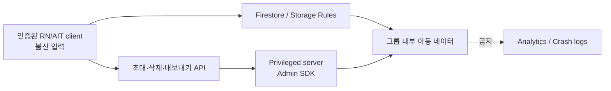

# Security Threat Model

## Scope

이 문서는 MVP의 `groups`, `members`, `babies`, `events`, `activeSleeps`, `eventMutationReceipts`, `invites`, 아기 이미지 Storage 경계를 다룬다. 앱의 직접 사용자는 성인 양육자지만 저장 대상에는 아동의 식별·돌봄·건강·사진 정보가 포함되므로 기본 공개나 추측 가능한 링크 공유를 허용하지 않는다.

현재 증거는 로컬 Rules 테스트, client transaction adapter Jest, Functions 순수 unit/Firestore Admin transaction Emulator 테스트와 platform custom token bridge 단위 테스트다. 또한 실제 signer resource IAM·registry sync·API 배포, 신규 custom token 교환과 합성 legacy UID 보존 live smoke까지 검증했다. App Check client/Platform 검증 경계와 계정 삭제 workflow는 구현·로컬 검증했으며, 실제 기존 사용자 migration, App Check 실기기 token, 계정 삭제 production callable·일회성 live QA가 남았다.

## Data Classification

| 등급 | 예시 | 기본 처리 |
| --- | --- | --- |
| 민감 | 성장·체온·투약·예방접종·증상·사진 | 초대된 그룹 멤버만, Analytics/Crash log 금지 |
| 준민감 | 수유·기저귀·수면·메모·기록 시각 | 초대된 그룹 멤버만, 필요한 최소 field만 저장 |
| 일반 | 성인 표시 이름·역할·표시색 | 그룹 내부만. 공개 profile로 사용하지 않음 |
| 운영 비밀 | service account·private key·Admin credential | client/repo 금지, server/CI secret store만 |

## Trust Boundaries

- client 인증은 신원만 증명한다. 권한은 매 요청 시 Firestore membership 문서로 재평가한다.
- Admin SDK는 Security Rules를 우회하므로 client에 포함하지 않고, callable API에서 인증·권한·입력·재사용 방지를 별도로 검증해야 한다.
- 오프라인 캐시는 서버 접근 회수와 별개다. 멤버 제거 시 새 요청은 즉시 차단되지만 이미 내려받은 데이터 삭제는 app workflow가 담당한다.

## Threats, Controls, Evidence

| 위협 | 통제 | 현재 증거 | 잔여 작업 |
| --- | --- | --- | --- |
| 비멤버가 group ID를 추측해 아동 데이터 조회 | parent group 존재 + `members/{uid}` 존재를 Rules에서 모두 확인 | Firestore/Storage Emulator 비멤버·비로그인 deny 테스트 | App Check와 abuse monitoring |
| 일반 멤버가 owner 권한으로 승격하거나 타 멤버 제거 | membership write는 owner만, ownerId/owner role 일치, owner membership 삭제 금지 | owner/member create·update·delete 테스트 | 소유권 이전 server workflow |
| 다른 양육자 명의로 event 위조 | create 시 `caregiverId == request.auth.uid` | forged author deny 테스트 | Admin 기록 생성 시 audit actor 설계 |
| 작성자·아기·그룹·종류를 바꿔 기록 출처 세탁 | event identity와 createdAt 불변, revision 단조 증가 | identity 변조 deny 테스트 | server-side export에 revision 포함 |
| 교대 양육자의 sleep 종료 권한으로 원 기록 변조 | active sleep에 한해 `endedAt <= updatedAt`, 최대 48시간인 close-only 전이만 허용 | 타 작성자 sleep close allow와 timestamp 불일치/payload/delete/reclose deny 테스트 | offline client가 선택한 과거 종료시각 신뢰와 종료자 audit actor 표시 검토 |
| 서로 다른 기기가 active sleep을 동시에 시작 | `activeSleeps/{babyId}` singleton을 event와 같은 transaction에 생성·종료하고 단독 event/lock write를 Rules에서 거부 | 동시 batch 2건 중 정확히 1건 성공, 원자 close 테스트 | 실제 2기기 loser conflict UX |
| Firestore commit 응답 유실 후 mutation 중복·오판 | canonical SHA-256·actor·전체 transport payload가 결합된 immutable receipt를 event metadata와 원자 기록. 기존 receipt exact get은 actor만 허용하고 list/query는 거부한다 | divergent same-revision conflict, later-revision lost-ack adapter 테스트와 event↔receipt 양방향·missing/existing get Rules 테스트 | 실제 network cut/reconnect smoke, 유효 ID existence oracle, PII 중복 receipt retention/cleanup 정책 |
| 기록 hard delete/undelete로 감사 흔적 제거 | client hard delete 금지, 작성자의 1회 soft delete만 허용 | delete, mixed mutation, undelete, post-delete update deny 테스트 | retention/완전 삭제 정책과 server cleanup |
| group 문서만 삭제한 뒤 동일 ID를 재사용해 orphan 문서·사진 탈취 | client group delete 금지, server-only tombstone ID 재사용 거부 | owner group delete와 tombstoned ID create deny 테스트 | server recursive delete가 tombstone을 먼저 기록하도록 구현 |
| baby 문서 삭제·동일 ID 재생성으로 과거 사진 재연결 | client baby delete 금지, server-only baby tombstone | owner baby delete와 tombstoned ID create deny 테스트 | server가 Storage/event 정리 후 tombstone 유지 |
| 미래 event/update timestamp로 타임라인·revision 오염 | server Rules 평가 시각 +5분 상한 | future create/update/sleep-end deny 테스트 | device clock 오류 UX와 server timestamp 전략 |
| listener error를 빈 server snapshot으로 오인해 로컬 기록 소실 | cache/pending snapshot은 무시하고 server-confirmed snapshot과 typed error를 분리 | adapter metadata/error Jest, local error snapshot 보존 테스트 | 실제 permission revoke 재현 |
| 로그아웃·멤버 제거 뒤 내려받은 아동 데이터 잔존 | Auth/membership/event observer 중단→in-flight sync generation 무효화→scoped envelope purge→revoked 상태 순서. concurrent close보다 purge가 우선되고 replacement writer는 보호한다 | sign-out, identity 변경, server-only membership 재확인, in-flight push·observer·close/purge race Jest | native Firestore disk persistence OFF와 실제 기기 purge 확인 |
| disabled/deleted/revoked-token 계정의 local Auth identity 잔존 | Auth observer와 remote unauthenticated 오류를 함께 처리하고 `reload`+강제 ID-token refresh로 서버 identity를 검증한다 | revoked error mapping, identity 변경, 반복 401·teardown recovery 차단 Jest | 실제 production provider에서 disabled/deleted/revoked-token별 purge smoke |
| custom token 전환 중 기존 UID 단절 | 기존 Firebase ID token을 platform이 검증해 같은 uid로 서명하고 client가 bridge·Firebase credential uid를 이중 대조 | legacy uid 보존, mismatch fail-closed Jest와 platform service 테스트, 합성 legacy UID live 교환 | 실제 기존 사용자·실기기 migration |
| 공개 custom token bootstrap 남용 | feature allowlist, uid 서버 생성, private key 없는 resource-level IAM 원격 서명 | 임의 uid 주입 live 거부, 앱 SA resource-level Token Creator, 신규 custom token live 교환 | App Check 또는 edge rate limit과 비용 alert |
| 초대 raw code 유출·재사용·임의 membership 생성 | raw 미저장, HMAC hash, current owner, expiry, single-use transaction, 7-field Admin membership | unit + Firestore Emulator owner/expiry/concurrent accept/audit 테스트 | 실제 callable Auth/App Check/Secret Manager smoke |
| 6자리 code online brute force | 유효 형식 실패도 먼저 커밋되는 UID별 rate limit, accept 상태 oracle 통합 | UID rate threshold Emulator 테스트 | verified Auth, anonymous UID 정책, App Check 강제 |
| HMAC key 유출·rotation으로 기존 초대 무효화 | deploy-time secret, 최소 32 bytes fail-closed, 24h 기본 TTL, previous key 없이 active invite 무효화+재발급 | unit secret/hash 테스트 | Secret Manager IAM과 owner 재발급 안내 운영 검증 |
| 사진 URL 유출 또는 임의 파일 저장 | 그룹-scoped object path, membership 재평가, image MIME/10 MiB 제한, token URL 저장 금지 | member/nonmember, MIME, unscoped path, membership revoke 테스트 | EXIF 제거, malware/content 검사 필요성 검토 |
| Analytics/Crashlytics로 아동 정보 유출 | core event에는 동작 type만, PII/기록 값 금지 정책 | 문서 정책만 있음 | adapter allowlist 테스트와 console 검수 |
| service credential 유출 | repo/client 금지, 실제 project 미생성 | `.gitignore`, 문서 정책 | CI secret/IAM 최소권한 검수 |

## Security Invariants

1. 그룹 문서나 `babyIds` 배열만으로 접근을 허용하지 않는다.
2. 멤버 제거 뒤 Firestore와 Storage의 새 요청은 즉시 실패해야 한다.
3. owner 권한은 group `ownerId`와 owner membership이 함께 일치해야 한다.
4. client는 invite를 직접 생성·읽기·수락하지 않는다.
5. invite raw code는 Firestore/audit/log에 저장하지 않고 callable create 응답에서만 1회 반환한다.
6. event hard delete와 undelete는 client 권한에 없다.
7. group hard delete는 client 권한에 없다. server가 하위 문서와 Storage를 먼저 안전하게 정리하고 ID 재사용을 막는다.
8. baby hard delete도 client 권한에 없다. Storage는 실제 baby 문서와 membership이 모두 있어야 접근할 수 있다.
9. 공개 download token URL, 아기 이름, 생년월일, 사진 경로, 돌봄 기록 값은 Analytics/Crash log에 넣지 않는다.
10. Remote Config나 UI 숨김은 보안 통제가 아니다.

## Release Blockers

- 실제 non-production Functions/Auth callable, Secret Manager, App Check, IAM 통합 검증
- `FUNCTIONS_REGION`, HMAC rotation/reissue, platform auth bridge App Check 또는 edge rate limit 확정
- 계정/그룹 완전 삭제, 데이터 export, owner 이전의 재인증·권한 설계
- 멤버 제거/로그아웃 시 mobile·AIT 로컬 캐시 purge 검증
- custom token 계정 복구·탈퇴 정책
- production Auth provider에서 remote unauthenticated 후 disabled/deleted/revoked-token 분류와 실제 cache purge 검증
- App Check mobile 적용 및 AppsInToss 호환성 검증
- Storage EXIF 처리와 사진 보존 기간 결정
- 실제 non-production project에서 Rules, indexes, Storage↔Firestore IAM 통합 검증
