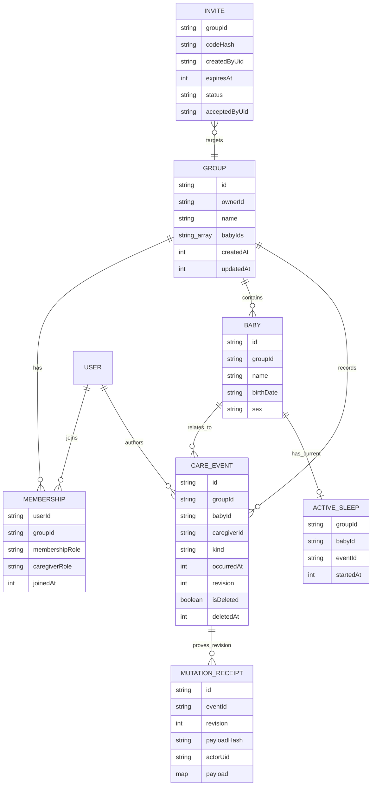
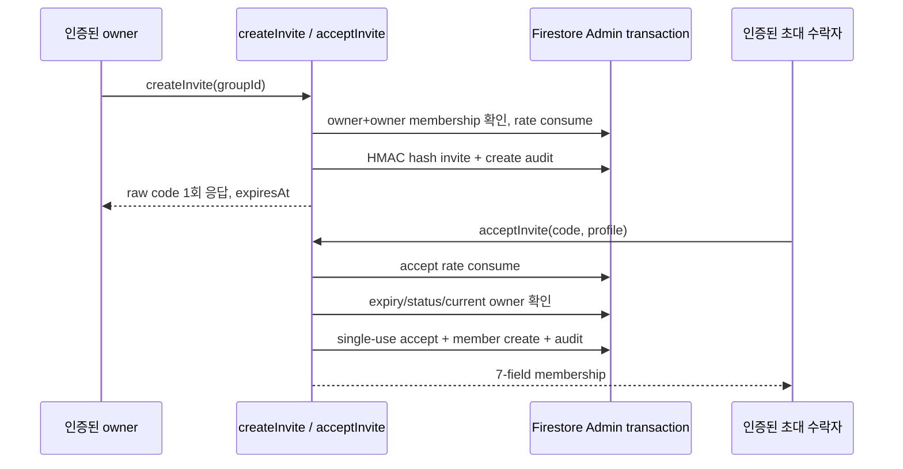

# Firebase

## 상태와 Project Strategy

- Planning approval: `완료` (2026-07-12)
- Firebase 사용: `확정` — Auth, 실시간 공동 기록, 클라우드 보존이 제품 핵심이다.
- Project strategy: `babycare 전용 Firebase project` — production 적용 완료
  - 아동의 이름·생년월일·돌봄 기록을 다른 앱과 분리한 전용 Auth, Rules, Functions 운영 경계를 사용한다.
- Firebase project ID: `seorilabs-babycare`
- Region: `asia-northeast3`
- Cloud Billing: `활성` — 2026-08-07 `gcloud beta billing projects describe seorilabs-babycare`에서 `billingEnabled=true` readback. 연결된 billing account 식별자는 보안상 원장에 기록하지 않는다.
- Production project provisioning/deploy: Auth·Firestore Rules/indexes·Storage·초대/계정 삭제 callable 운영 중. 체온·복약 exact schema를 포함한 Rules를 2026-08-10 ruleset `8c1ee475-b15f-44ea-9695-009dfe3621a4`로 배포하고 local/remote SHA-256 일치를 readback했다.
- Functions slice: `createInvite`·`acceptInvite`·`deleteAccount` production ACTIVE. AppsInToss GA4 중계 `logAnalyticsEvents`도 `GA4_MEASUREMENT_ID`와 Secret Manager의 `GA4_API_SECRET`을 사용해 production ACTIVE이며, 인증된 callable smoke에서 `accepted=1`을 확인했다(2026-08-09). AIT attestation용 `mintAitAppCheckToken`은 source·unit test 완료, mTLS secret 연결과 production 배포 pending이다.

로컬 규칙 검증은 실제 project나 자격증명 없이 `babycare-rules-test`라는 Emulator 전용 project ID로만 실행한다.

## Services

| Service | 사용 여부 | 용도/경계 |
| --- | --- | --- |
| Auth | 예 | 성인 양육자 신원과 그룹 멤버십 연결. production mobile은 platform custom token bridge, 개발 Emulator는 direct anonymous |
| Firestore | 예 | 그룹, 멤버십, 아기, 돌봄 이벤트 실시간 동기화. native app composition과 production project 연결 완료 |
| Storage | 예 | 기본 bucket과 Rules 운영. 그룹 경로의 지원 이미지, 파일당 10 MiB 이하만 허용. 현재 MVP UI에 upload 흐름 없음 |
| Cloud Functions / Run | 예 | 초대·삭제 callable 운영. `logAnalyticsEvents`는 인증·allowlist·PII key 차단 후 GA4 Measurement Protocol로 최대 20개를 중계하며 production ACTIVE. `mintAitAppCheckToken`은 Toss mTLS login 검증 후 AIT Web app ID의 1시간 App Check token을 발급하도록 구현, 배포 pending |
| Analytics | 예 | GA4 property `549232169`, Android/iOS/Web data stream과 BigQuery daily+streaming link 운영. Realtime `core_screen_view=1` 및 callable `accepted=1` readback. 동일 제품 이벤트를 Platform Events에도 fan-out |
| Remote Config | MVP 미사용 | 후속 기능 flag/tuning 후보. 보안 결정에는 사용하지 않음 |
| Crashlytics | 연결 전 | PII/돌봄 기록 값을 log·custom key에 넣지 않음 |
| Performance | 미사용 | 현재 의존성·native 구성에 포함하지 않음. 도입 시 privacy disclosure 재검토 |
| FCM | MVP 밖 | 후속 opt-in 리마인더·공동 기록 알림 후보. 민감 내용을 잠금화면에 기본 노출하지 않음 |
| App Check | 예 | mobile에 Play Integrity·App Attest·DeviceCheck fallback 적용. production callable `ENFORCE_APP_CHECK=true`, Platform `require_app_check=true`. AIT는 `appLogin`·mTLS 기반 custom provider source 구현 완료, 운영 secret·Function·비공개 실기기 QA pending |

## Firestore Model



```text
groups/{groupId}
groups/{groupId}/members/{uid}
groups/{groupId}/babies/{babyId}
groups/{groupId}/babyTombstones/{babyId} # privileged server-only, baby ID 재사용 방지
groups/{groupId}/events/{eventId}
groups/{groupId}/activeSleeps/{babyId} # 진행 중 수면 singleton lock
groups/{groupId}/eventMutationReceipts/{mutationId} # immutable revision receipt
invites/{inviteId}
groupTombstones/{groupId}            # privileged server-only, group ID 재사용 방지
functionRateLimits/{uid}/actions/{action} # server-only 고정 window rate limit
auditLogs/{auditId}                  # server-only actor/action audit
```

- `groups/{groupId}/members/{uid}` 존재 여부가 유일한 client access 권위 원장이다. `groups`의 배열이나 client claim을 권한 판정에 사용하지 않는다.
- 시간은 `packages/product-core`와 동일하게 epoch milliseconds 정수로 저장한다.
- `events`는 `feeding | diaper | sleep | temperature | medication` subtype별 허용 field와 값 범위를 Rules에서 재검증한다. 체온은 섭씨 30.0~45.0과 측정부위, 복약은 이름·분류·주성분·실제 투여량·단위·사용자 확인 간격을 exact schema로 검증한다.
- `events`의 마지막 mutation metadata와 `eventMutationReceipts`는 같은 transaction에서만 생성·갱신된다. receipt ID는 event ID·revision·client canonical SHA-256에 결합한다. Rules는 hash를 직접 계산하지 않고 receipt가 보존한 전체 event payload를 같은 transaction의 event map과 비교하며 actor·kind·revision을 검증한다.
- `activeSleeps/{babyId}`는 baby별 진행 중 수면 1건을 강제하며 event 생성·종료와 같은 transaction에서 생성·삭제한다.
- 모유 수유는 `leftDurationSeconds`, `rightDurationSeconds`를 독립 저장하고 합계 12시간 이하를 검증한다. 삭제 여부는 query 가능한 `isDeleted`와 선택 `deletedAt`의 존재가 반드시 일치해야 한다.
- `avatarStoragePath`에는 `groups/{groupId}/babies/{babyId}/...` object path만 저장하며 공개 download token URL은 금지한다.
- `invites`는 client SDK가 직접 읽거나 쓰지 못한다. Functions가 HMAC hash lookup, 만료, 1회 사용 transaction을 검증하고 Admin SDK로 7-field 멤버십을 생성한다.
- 초대 raw code는 어느 문서에도 저장하지 않는다. ambiguity-safe alphabet `ABCDEFGHJKLMNPQRSTUVWXYZ23456789`의 6자리 code만 생성하고, HMAC-SHA256 hash를 invite ID/lookup key로 쓴다.
- `auditLogs`에는 `actorUid`, `action`, `groupId`, `inviteId`, accept 시 `targetUid`/`invitedByUid`를 기록한다. raw code와 아동 정보는 기록하지 않는다.
- `functionRateLimits`는 인증 UID별 create/accept 시도를 별도 transaction으로 먼저 소비하므로 유효 형식의 존재하지 않는 code도 횟수에 포함된다.
- `groupTombstones`도 client read/write를 전면 거부하며, server 삭제 workflow가 group ID 재사용을 영구 차단한다.
- `babyTombstones`도 같은 원칙으로 아기 ID와 기존 Storage object의 재연결을 막는다.

## Authorization Matrix

| 리소스/동작 | 비로그인·비멤버 | member | owner | privileged server |
| --- | --- | --- | --- | --- |
| 그룹/멤버/아기/event read | 거부 | 허용 | 허용 | Admin 정책에 따름 |
| event create | 거부 | 본인 `caregiverId`만 | 본인 `caregiverId`만 | 필요 시 허용 |
| event 일반 update | 거부 | 원 작성자만. 단 active sleep 종료는 모든 멤버 close-only 허용 | 동일 | 감사 workflow |
| event soft delete | 거부 | 원 작성자만 | 원 작성자인 경우만 | 보존·삭제 workflow |
| event hard delete | 거부 | 거부 | 거부 | 보존/삭제 정책에 따른 batch cleanup |
| active sleep lock | 거부 | event와 원자 create/delete만 | 동일 | 복구 workflow |
| mutation receipt | 거부 | event와 원자 create. 미존재 valid ID get과 자기 actor의 기존 exact get만 허용, list/query·update/delete 거부 | 동일 | retention/cleanup workflow |
| group hard delete | 거부 | 거부 | 거부 | recursive delete + tombstone workflow |
| 최초 owner membership 생성 | 거부 | 거부 | 자기 자신만 group과 atomic batch 생성 | 필요 시 복구 workflow |
| 초대 멤버 membership 생성 | 거부 | 거부 | client 직접 생성 거부 | 초대 수락 transaction만 |
| membership 수정·삭제 | 거부 | 거부 | 허용. owner membership 삭제·복수 owner 승격은 거부 | 소유권 이전 |
| baby 생성·수정 | 거부 | read-only | 허용 | 필요 시 관리 workflow |
| baby hard delete | 거부 | 거부 | 거부 | Storage/event cleanup + tombstone workflow |
| invite read/write | 거부 | 거부 | 거부 | 전용 Functions/Run만 |
| Storage 아기 이미지 | 거부 | read/write | read/write | 삭제/export workflow |

이벤트의 `id`, `groupId`, `babyId`, `caregiverId`, `kind`, `createdAt`은 생성 후 바꿀 수 없다. 수정할 때 `revision`은 정확히 1 증가해야 하고 client timestamp는 Rules 평가 시각보다 5분을 초과해 미래일 수 없다. 삭제는 작성자가 `deletedAt == updatedAt`과 `isDeleted == true`를 함께 설정하는 1회 soft delete로 제한하며, hard delete와 undelete는 client에서 금지한다. 교대 양육자는 다른 사람이 시작한 active sleep을 종료할 수 있지만 `endedAt <= updatedAt`, 최대 48시간이어야 하고 `endedAt`, `updatedAt`, `revision` 외 field는 바꿀 수 없다.

## Mobile Adapter 상태

`apps/mobile/src/adapters/firebase/`에 다음 client 구현이 있다.

- `FirebaseAuthAdapter`: production에서는 Seorilabs platform custom token bridge와 RNFirebase `signInWithCustomToken`을 사용한다. 기존 anonymous 사용자는 현재 ID token을 bridge에 보내 같은 uid로 전환하고, 신규 uid는 platform 서버가 생성한다. `signInAnonymously`는 Firebase Emulator 개발 경로에만 남긴다. `reload`+강제 ID-token refresh 검증은 유지한다.
- `FirebaseCareGroupRepository`, `FirebaseBabyRepository`: group/membership/baby 문서와 atomic owner setup. 권한 오류 뒤 membership 재확인은 server-only query를 사용한다.
- `FirebaseCareEventRemoteStore`: strict path/schema decoder, revision transaction·payload receipt·active-sleep lock transport와 `CareEventProjectionRemotePort`의 server-only window/latest/active singleton fetch·observe.
- `FirebaseInviteService`: `createInvite`/`acceptInvite` callable과 응답 actor/path 검증.

실제 앱의 `App.tsx`는 native Firebase 공동 기록 root를 동적 로드하고 Jest만 AsyncStorage local preview를 사용한다. cloud factory는 인증 scope별 timeline과 overview projection owner를 각각 하나씩 만든다. platform bridge의 signer resource IAM·registry sync·production API 배포와 신규·합성 legacy UID live smoke는 2026-08-02 완료했다. mobile App Check 강제와 실기기 migration도 완료했으며 AIT mTLS attestation 운영 연결·실기기 검증은 별도 gate다.

`FirebaseCareEventRemoteStore.push`는 server acknowledgement까지 기다리는 원격 계약이다. 이를 `CareEventRepositoryPort` 대신 화면 use case에 직접 주입하면 offline 저장 UI가 완료되지 않을 수 있으므로 금지한다. `care-event-container.ts`는 `packages/product-data`의 scoped durable envelope/outbox에 먼저 저장하고 remote mutation을 revision 순서로 drain하며 pending/failed/conflict 상태를 노출한다. `CareEventOverviewFeed`는 server-confirmed 기간 window, 종류별 latest와 `activeSleeps/{babyId}`→event singleton을 결합해 envelope v3의 named overview/active coverage를 atomic 교체한다.

## Invite Callable Contract



| Callable | 인증/권한 | 입력 | 응답 |
| --- | --- | --- | --- |
| `createInvite` | Auth 필수, current group owner+owner membership | `groupId` | `code`, `createdAt`, `expiresAt`, `groupId`, `inviteId` |
| `acceptInvite` | Auth 필수 | `code`, `displayName`, 선택 `caregiverRole`, `color` | 7-field membership |
| `deleteAccount` | Auth 필수, `DELETE` 명시 확인 | `confirmation` | 삭제한 group·event·storage object 수와 owner 여부 |

- code 존재/만료/타인 사용/이미 멤버/current owner 이상은 외부에서 구분할 수 없도록 동일 `failed-precondition`으로 반환한다.
- 같은 UID가 네트워크 결과 유실 뒤 재호출하면 기존 membership을 idempotent하게 반환하지만 다른 UID의 재사용은 실패한다.
- `inviteId`는 core `CareGroupInvite.id`와 고객지원 audit correlation을 위해 adapter에 반환한다. HMAC digest이며 UI/Analytics/Crash log에 남기지 않는다.
- Functions 배포 런타임은 `nodejs22`, 패키지는 `firebase-functions@7.2.5` + peer-compatible `firebase-admin@13.10.0`이다.

### Deploy-time params

| Param | 종류 | 상태/기본값 |
| --- | --- | --- |
| `FUNCTIONS_REGION` | `defineString` | production `asia-northeast3`, 기본값 없음 |
| `INVITE_CODE_HMAC_KEY` | `defineSecret` | production Secret Manager 연결 완료, 값은 repo/client 금지 |
| `INVITE_TTL_HOURS` | `defineInt` | 기본 24 |
| `INVITE_CREATE_LIMIT_PER_HOUR` | `defineInt` | 기본 10/UID |
| `INVITE_ACCEPT_LIMIT_PER_HOUR` | `defineInt` | 기본 20/UID |
| `ENFORCE_APP_CHECK` | `defineBoolean` | 코드 기본 false, production Parameter true |
| `AIT_LOGIN_CLIENT_CERT` | `defineSecret` | AppsInToss login API mTLS certificate, 운영 연결 pending |
| `AIT_LOGIN_CLIENT_KEY` | `defineSecret` | AppsInToss login API mTLS private key, 운영 연결 pending |

Production `FUNCTIONS_REGION`은 `asia-northeast3`이다. `firebase/callable-access.json`은 callable의 project·region·Cloud Run service 접근 계약과 런타임 서비스 계정의 Firestore·Auth·Storage 역할, App Check token 서명을 위한 자기 자신 대상 `Service Account Token Creator` 원장이며, 다음 명령으로 운영 상태를 읽기 전용 확인하거나 명시적으로 복구한다.

```bash
pnpm run check:firebase:live-callables
pnpm run configure:firebase:callable-access
```

조직의 Domain Restricted Sharing 정책 때문에 `allUsers` IAM binding은 허용되지 않는다. callable과 AIT mint Cloud Run service는 Invoker IAM check를 비활성화해 요청이 함수까지 도달하게 한다. callable은 Firebase Auth/App Check와 owner/membership 검사를 유지하고, mint endpoint는 Toss mTLS 로그인 검증을 별도 애플리케이션 권한 경계로 사용한다.

## Indexes

`firebase/firestore.indexes.json`에 다음 그룹별 timeline·overview query를 둔다.

- `events`: `babyId ASC, occurredAt DESC` (raw bounded timeline; document ID tie-break는 implicit ordering)
- `events`: `babyId ASC, kind ASC, occurredAt DESC` (종류별 window)
- `events`: `babyId ASC, isDeleted ASC, occurredAt DESC` (legacy/filtered event query)
- `events`: `babyId ASC, isDeleted ASC, kind ASC, occurredAt DESC` (종류별 latest)

local adapter/Jest가 query shape와 server-confirmed filtering을 검증한다. production의 네 index는 `READY`이며 `members.userId` collection-group query도 확인했다. listener 재연결·read 비용·기기 2대 경계는 별도 QA가 필요하다.

## Rules와 Emulator 검증

- Firestore rules: `firebase/firestore.rules`
- Firestore indexes: `firebase/firestore.indexes.json`
- Storage rules: `firebase/storage.rules`
- Emulator tests: `firebase/tests/security-rules.test.mjs`
- Functions source: `firebase/functions/src/`
- Functions unit tests: `firebase/functions/tests/`
- Functions Firestore Emulator tests: `firebase/functions/tests/*.emulator.test.ts`

```bash
pnpm run test:firebase
pnpm run test:functions
pnpm run test:functions:emulator
```

Rules 23건은 비멤버 차단, 멤버 read/record, 동일 timestamp raw timeline cursor, 자기 membership query, owner-only 관리, event/receipt/active-lock 원자성, receipt missing/existing exact-get·list/query 경계, soft delete, invite 차단, Storage 권한을 다룬다. Functions unit 14건과 transaction Emulator 7건은 HMAC/raw-code 비저장, owner gate, expiry, UID rate limit, audit actor, idempotent replay, 동시 accept single-use와 owner/member 계정 삭제 범위를 다룬다. 초대 callable deploy·Secret Manager·Cloud Run 진입은 확인했으며 계정 삭제 production 배포, App Check 실기기 token과 인증된 2계정 흐름은 별도다.

## Deployment Gates

- service account JSON, private key, Admin SDK credential을 client나 repo에 포함하지 않는다.
- production project·rules/index·Functions·Secret Manager는 운영 중이다. 환경 분리와 추가 IAM 변경은 deployment approval과 이 원장의 계약을 따른다.
- `FUNCTIONS_REGION`은 `asia-northeast3`, `INVITE_CODE_HMAC_KEY`는 production Secret Manager에 연결됐다. MVP HMAC rotation 정책은 previous key fallback 없이 모든 미사용 초대를 무효화하고 owner가 재발급하는 방식이다. 기본 TTL이 최대 24시간이므로 계획 rotation은 만료 대기 후 수행하고, 긴급 rotation은 즉시 재발급 안내한다.
- 6자리 code는 30-bit이므로 UID rate limit만으로 충분하지 않다. production uid는 platform custom token bridge가 서버에서 만들고 기존 uid는 서명된 Firebase ID token으로만 승계한다. mobile은 App Check 강제를 운영 중이며 AIT는 mTLS attestation 포함 새 비공개 번들 검증 전까지 release-ready가 아니다.
- production `ENFORCE_APP_CHECK=true`와 Platform `require_app_check=true`는 유지한다. 기존 AIT 비공개 번들의 header 누락은 강제를 끄지 않고 AIT custom provider로 해결한다.
- Storage Rules가 Firestore membership을 조회하므로 실제 project에서 두 서비스 연결용 IAM 설정을 확인한다.
- 계정 삭제 server/app workflow와 그룹 recursive delete·tombstone·로컬 cache purge는 구현·Emulator 검증을 마쳤다. production callable 배포와 일회성 owner/member 계정 live QA는 release blocker로 남는다. 데이터 export와 소유권 이전은 별도 정책·기능 결정이 필요하다.
- mutation receipt가 revision 당시 event payload를 중복 보존하므로 offline retry window와 충돌하지 않는 보존 기간·cleanup/export/완전 삭제 정책을 실제 project 배포 전에 확정한다. 신규 transaction을 위한 미존재 valid-ID get은 허용하므로 exact ID 존재 여부 oracle도 abuse 검토에 포함한다.
- AIT mTLS secret과 mint Function을 배포한 뒤 실제 Toss 비공개 번들에서 token 발급·갱신·복구 절차를 검증한다.

상세 위협과 잔여 위험은 `docs/03-architecture/security-threat-model.md`를 따른다.
