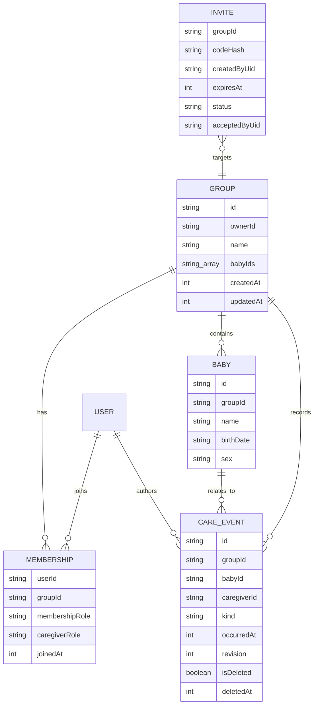
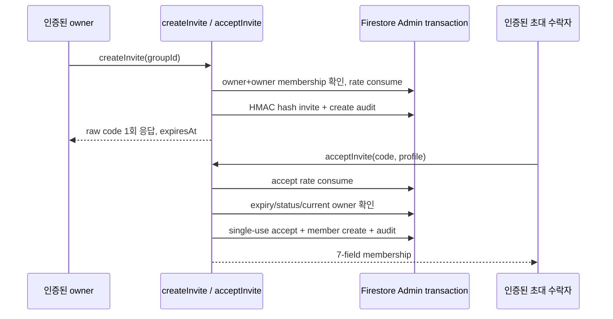

# Firebase

## 상태와 Project Strategy

- Planning approval: `완료` (2026-07-12)
- Firebase 사용: `확정` — Auth, 실시간 공동 기록, 클라우드 보존이 제품 핵심이다.
- Project strategy: `babycare 전용 Firebase project` 권장안 — `확정 필요`
  - 아동의 이름·생년월일·돌봄 기록을 다루므로 다른 앱과 Auth, Rules, Analytics, 운영 권한을 분리하는 안이 기본이다. 실제 project 생성 전 사용자 확정을 받는다.
- Firebase project ID: `확정 필요`
- Region: `확정 필요`
- Billing plan: `확정 필요`
- Production project provisioning/deploy: deployment approval 전 금지
- Functions invite slice: 로컬 구현·unit/Firestore Emulator 테스트 코드 추가, 현재 변경 snapshot 재실행과 실제 callable deploy 미실행

로컬 규칙 검증은 실제 project나 자격증명 없이 `babycare-rules-test`라는 Emulator 전용 project ID로만 실행한다.

## Services

| Service | 사용 여부 | 용도/경계 |
| --- | --- | --- |
| Auth | 예 | 성인 양육자 신원과 그룹 멤버십 연결. RNFirebase adapter는 있으나 production 로그인 provider는 확정 필요 |
| Firestore | 예 | 그룹, 멤버십, 아기, 돌봄 이벤트 실시간 동기화. adapter는 구현됐지만 app composition과 project config는 미연결 |
| Storage | Rules만 준비 | 그룹 경로의 지원 이미지, 파일당 10 MiB 이하만 허용. 현재 MVP UI에 upload 흐름 없음 |
| Cloud Functions / Run | 예 | `createInvite`, `acceptInvite` 로컬 구현. 실제 callable deploy와 App Check/Secret Manager 미검증 |
| Remote Config | MVP 미사용 | 후속 기능 flag/tuning 후보. 보안 결정에는 사용하지 않음 |
| Analytics | 연결 전 | event type 등 PII-free allowlist만 허용. 현재 app composition은 no-op |
| Crashlytics | 연결 전 | PII/돌봄 기록 값을 log·custom key에 넣지 않음 |
| Performance | `확정 필요` | privacy disclosure와 필요성 확인 후 추가 |
| FCM | MVP 밖 | 후속 opt-in 리마인더·공동 기록 알림 후보. 민감 내용을 잠금화면에 기본 노출하지 않음 |
| App Check | 예 | mobile 적용 예정. AppsInToss 호환성과 debug token 운영은 확정 필요 |

## Firestore Model



```text
groups/{groupId}
groups/{groupId}/members/{uid}
groups/{groupId}/babies/{babyId}
groups/{groupId}/babyTombstones/{babyId} # privileged server-only, baby ID 재사용 방지
groups/{groupId}/events/{eventId}
invites/{inviteId}
groupTombstones/{groupId}            # privileged server-only, group ID 재사용 방지
functionRateLimits/{uid}/actions/{action} # server-only 고정 window rate limit
auditLogs/{auditId}                  # server-only actor/action audit
```

- `groups/{groupId}/members/{uid}` 존재 여부가 유일한 client access 권위 원장이다. `groups`의 배열이나 client claim을 권한 판정에 사용하지 않는다.
- 시간은 `packages/product-core`와 동일하게 epoch milliseconds 정수로 저장한다.
- `events`는 `feeding | diaper | sleep` subtype별 허용 field와 값 범위를 Rules에서 재검증한다.
- 모유 수유는 `leftDurationSeconds`, `rightDurationSeconds`를 독립 저장하고 합계 12시간 이하를 검증한다. 삭제 여부는 query 가능한 `isDeleted`와 선택 `deletedAt`의 존재가 반드시 일치해야 한다.
- `avatarStoragePath`에는 `groups/{groupId}/babies/{babyId}/...` object path만 저장하며 공개 download token URL은 금지한다.
- `invites`는 client SDK가 직접 읽거나 쓰지 못한다. Functions가 HMAC hash lookup, 만료, 1회 사용 transaction을 검증하고 Admin SDK로 7-field 멤버십을 생성한다.
- 초대 raw code는 어느 문서에도 저장하지 않는다. ambiguity-safe alphabet `ABCDEFGHJKLMNPQRSTUVWXYZ23456789`의 6자리 code만 생성하고, HMAC-SHA256 hash를 invite ID/lookup key로 쓴다.
- `auditLogs`에는 `actorUid`, `action`, `groupId`, `inviteId`, accept 시 `targetUid`/`invitedByUid`를 기록한다. raw code와 아동 정보는 기록하지 않는다.
- `functionRateLimits`는 인증 UID별 create/accept 시도를 별도 transaction으로 먼저 소비하므로 유효 형식의 존재하지 않는 code도 횟수에 포함된다.
- `groupTombstones`도 client read/write를 전면 거부하며, server 삭제 workflow가 group ID 재사용을 영구 차단한다.
- `babyTombstones`도 같은 원칙으로 아기 ID와 기존 Storage object의 재연결을 막는다.

## Authorization Matrix

| 리소스/동작 | 비로그인·비멤버 | member | owner | privileged server |
| --- | --- | --- | --- | --- |
| 그룹/멤버/아기/event read | 거부 | 허용 | 허용 | Admin 정책에 따름 |
| event create | 거부 | 본인 `caregiverId`만 | 본인 `caregiverId`만 | 필요 시 허용 |
| event 일반 update | 거부 | 원 작성자만. 단 active sleep 종료는 모든 멤버 close-only 허용 | 동일 | 감사 workflow |
| event soft delete | 거부 | 원 작성자만 | 원 작성자인 경우만 | 보존·삭제 workflow |
| event hard delete | 거부 | 거부 | 거부 | 보존/삭제 정책에 따른 batch cleanup |
| group hard delete | 거부 | 거부 | 거부 | recursive delete + tombstone workflow |
| 최초 owner membership 생성 | 거부 | 거부 | 자기 자신만 group과 atomic batch 생성 | 필요 시 복구 workflow |
| 초대 멤버 membership 생성 | 거부 | 거부 | client 직접 생성 거부 | 초대 수락 transaction만 |
| membership 수정·삭제 | 거부 | 거부 | 허용. owner membership 삭제·복수 owner 승격은 거부 | 소유권 이전 |
| baby 생성·수정 | 거부 | read-only | 허용 | 필요 시 관리 workflow |
| baby hard delete | 거부 | 거부 | 거부 | Storage/event cleanup + tombstone workflow |
| invite read/write | 거부 | 거부 | 거부 | 전용 Functions/Run만 |
| Storage 아기 이미지 | 거부 | read/write | read/write | 삭제/export workflow |

이벤트의 `id`, `groupId`, `babyId`, `caregiverId`, `kind`, `createdAt`은 생성 후 바꿀 수 없다. 수정할 때 `revision`은 정확히 1 증가해야 하고 client timestamp는 Rules 평가 시각보다 5분을 초과해 미래일 수 없다. 삭제는 작성자가 `deletedAt == updatedAt`과 `isDeleted == true`를 함께 설정하는 1회 soft delete로 제한하며, hard delete와 undelete는 client에서 금지한다. 교대 양육자는 다른 사람이 시작한 active sleep을 종료할 수 있지만 `endedAt <= updatedAt`, 최대 48시간이어야 하고 `endedAt`, `updatedAt`, `revision` 외 field는 바꿀 수 없다.

## Mobile Adapter 상태

`apps/mobile/src/adapters/firebase/`에 다음 client 구현이 있다.

- `FirebaseAuthAdapter`: RNFirebase Auth 상태·anonymous sign-in transport. anonymous를 production provider로 승인한 것은 아니다.
- `FirebaseCareGroupRepository`, `FirebaseBabyRepository`: group/membership/baby 문서와 atomic owner setup.
- `FirebaseCareEventRemoteStore`: realtime listener, `isDeleted == false` query, strict path/schema decoder와 server-ack `push` transport.
- `FirebaseInviteService`: `createInvite`/`acceptInvite` callable과 응답 actor/path 검증.

현재 `apps/mobile/src/app/container.ts`는 AsyncStorage 기반 local adapter를 사용한다. Firebase client config, production Auth provider와 app-level session/group 흐름이 확정되기 전에는 위 코드가 실제 화면의 cloud data path가 아니다.

`FirebaseCareEventRemoteStore.push`는 server acknowledgement까지 기다리는 원격 계약이다. 이를 `CareEventRepositoryPort` 대신 화면 use case에 직접 주입하면 offline 저장 UI가 완료되지 않을 수 있으므로 금지한다. production composition은 local durable repository/outbox에 먼저 저장하고, 원격 전송과 pending/failed/synced 상태를 별도 coordinator에서 관리해야 한다.

## Invite Callable Contract



| Callable | 인증/권한 | 입력 | 응답 |
| --- | --- | --- | --- |
| `createInvite` | Auth 필수, current group owner+owner membership | `groupId` | `code`, `createdAt`, `expiresAt`, `groupId`, `inviteId` |
| `acceptInvite` | Auth 필수 | `code`, `displayName`, 선택 `caregiverRole`, `color` | 7-field membership |

- code 존재/만료/타인 사용/이미 멤버/current owner 이상은 외부에서 구분할 수 없도록 동일 `failed-precondition`으로 반환한다.
- 같은 UID가 네트워크 결과 유실 뒤 재호출하면 기존 membership을 idempotent하게 반환하지만 다른 UID의 재사용은 실패한다.
- `inviteId`는 core `CareGroupInvite.id`와 고객지원 audit correlation을 위해 adapter에 반환한다. HMAC digest이며 UI/Analytics/Crash log에 남기지 않는다.
- Functions 배포 런타임은 `nodejs22`, 패키지는 `firebase-functions@7.2.5` + peer-compatible `firebase-admin@13.10.0`이다.

### Deploy-time params

| Param | 종류 | 상태/기본값 |
| --- | --- | --- |
| `FUNCTIONS_REGION` | `defineString` | `확정 필요`, 기본값 없음 |
| `INVITE_CODE_HMAC_KEY` | `defineSecret` | `확정 필요`, 최소 32 bytes, repo/client 금지 |
| `INVITE_TTL_HOURS` | `defineInt` | 기본 24 |
| `INVITE_CREATE_LIMIT_PER_HOUR` | `defineInt` | 기본 10/UID |
| `INVITE_ACCEPT_LIMIT_PER_HOUR` | `defineInt` | 기본 20/UID |
| `ENFORCE_APP_CHECK` | `defineBoolean` | 기본 false, AppsInToss 검증 후 출시 전 true 결정 |

## Indexes

`firebase/firestore.indexes.json`에 다음 그룹별 타임라인 query를 둔다.

- `events`: `babyId ASC, isDeleted ASC, occurredAt DESC`
- `events`: `babyId ASC, isDeleted ASC, kind ASC, occurredAt DESC`

## Rules와 Emulator 검증

- Firestore rules: `firebase/firestore.rules`
- Firestore indexes: `firebase/firestore.indexes.json`
- Storage rules: `firebase/storage.rules`
- Emulator tests: `firebase/tests/security-rules.test.mjs`
- Functions source: `firebase/functions/src/`
- Functions unit tests: `firebase/functions/tests/invite-service.test.ts`
- Functions Firestore Emulator tests: `firebase/functions/tests/firestore-invite-repository.emulator.test.ts`

```bash
pnpm run test:firebase
pnpm run test:functions
pnpm run test:functions:emulator
```

Rules 테스트는 비멤버 차단, 멤버 read/record, 자기 membership collection-group query, owner-only membership 관리, 작성자/identity 불변, soft delete, invite 직접 접근 차단, Storage 멤버 접근·크기 제한과 멤버 제거 후 즉시 차단을 다룬다. Functions 테스트는 HMAC/raw-code 비저장, owner gate, expiry, UID rate limit, audit actor, idempotent replay, 동시 accept single-use를 다룬다. 현재 변경 세트의 최종 PASS 수치는 전체 게이트 재실행 뒤 기록한다.

## Deployment Gates

- service account JSON, private key, Admin SDK credential을 client나 repo에 포함하지 않는다.
- 실제 Firebase project 생성, rules/index deploy, IAM 연결은 deployment approval 뒤 non-production 환경부터 진행한다.
- `FUNCTIONS_REGION`과 `INVITE_CODE_HMAC_KEY`는 실제 non-production 환경에서 먼저 확정한다. MVP HMAC rotation 정책은 previous key fallback 없이 모든 미사용 초대를 무효화하고 owner가 재발급하는 방식이다. 기본 TTL이 최대 24시간이므로 계획 rotation은 만료 대기 후 수행하고, 긴급 rotation은 즉시 재발급 안내한다.
- 6자리 code는 30-bit이므로 UID rate limit만으로 충분하지 않다. anonymous UID 무제한 발급을 허용하지 않고 verified Auth와 App Check를 함께 적용한다.
- `ENFORCE_APP_CHECK=false`는 AppsInToss 호환 검증용 임시값이다. 실제 Functions/Auth emulator callable protocol, App Check, Secret Manager binding, IAM은 non-production smoke 전 release-ready가 아니다.
- Storage Rules가 Firestore membership을 조회하므로 실제 project에서 두 서비스 연결용 IAM 설정을 확인한다.
- 계정 삭제, 그룹/아기 recursive delete+tombstone, export, 소유권 이전, 제거된 멤버의 로컬 캐시 삭제는 server/app workflow 구현 전 release blocker다. 삭제 workflow는 membership부터 회수한 뒤 파일·하위 문서·상위 문서를 정리하고 ID 재사용을 막아야 한다.
- App Check를 강제하기 전 AppsInToss 실기기 호환성과 복구 절차를 검증한다.

상세 위협과 잔여 위험은 `docs/03-architecture/security-threat-model.md`를 따른다.
