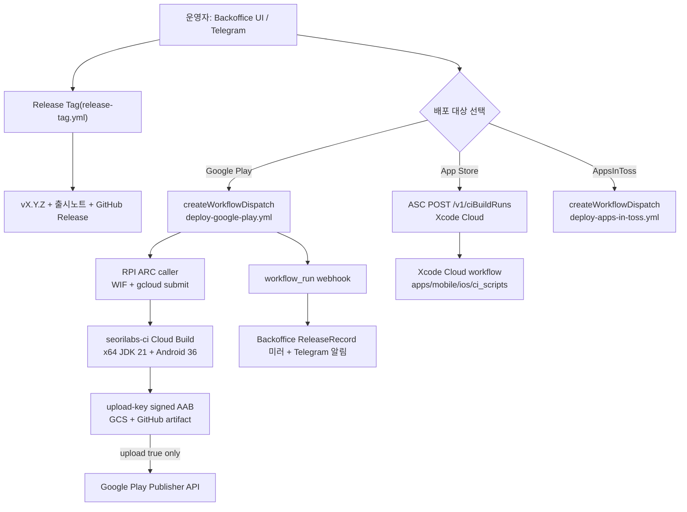

# 스토어 업로드 자동화 세팅 (백오피스 구동)

> **상태: `v1.1.3` Google Play·App Store 공개 완료.** 사용자가
> Android/iOS 실기기 QA 통과와 빠른 공개를 승인했고, 2026-08-21 양쪽 공개 listing에서 `1.1.3`을 readback했다. `main` push 는
> 정적 게이트(static-checks)만 돌고 업로드하지 않는다.

## 운영 진입점 = 백오피스/Telegram

배포는 `seorilabs-backoffice` 가 GitHub/App Store Connect API 로 구동한다(단방향
`API → workflow/ciBuildRuns → webhook 미러`). 앱은 **자동 발견**된다 — 백오피스 `seedRegistry()`
가 org repo 를 스캔해 `deploy-*.yml` 존재로 `marketTargets` 를, `*-store.config.json` 으로
식별자를 채운다. babycare 는 관련 파일이 모두 있어 `POST /api/admin/seed` 한 번이면
`marketTargets=["play","appstore","ait"]`, `iosBundle=com.seorilabs.babycare` 로 등록된다.

- **App Store 정본 = Xcode Cloud.** babycare 는 RNFirebase 라 Xcode 26.x 정적 링키지 회귀
  대상이라 macOS 러너 archive 실패 위험이 있어 org 이관 방향(Xcode Cloud)을 따른다.
  백오피스는 repo 가 `XCODE_CLOUD_APP_STORE_REPOS` allowlist 에 있으면 GH workflow_dispatch
  대신 ASC `ciBuildRuns` 로 트리거한다. GH Actions 에는 App Store 경로를 두지 않는다.
  백오피스가 멈추면 App Store Connect 의 Xcode Cloud 에서 해당 태그에 직접 Start Build 한다.
- **Google Play** 는 GH Actions의 RPI ARC caller가 WIF로 `seorilabs-ci` Cloud Build에
  제출하는 경로다. x64 빌더가 signed AAB를 만들고, `upload=true`일 때만 별도 ARC job이
  Google Play Publisher API를 호출한다.
- 업로드는 명시적 dispatch/ciBuildRuns 에서만. `deploy-*` 의 `upload` 입력이 `false` 면 아티팩트만.

## 리포 contract (준비 완료)

| 자산 | 상태 |
| --- | --- |
| exact SHA 중앙 release version authority | ✅ |
| `scripts/upload-google-play-internal.py` | ✅ |
| `scripts/restore-mobile-firebase-config.mjs` (`--android`/`--ios --require`) | ✅ |
| Android gradle `-PversionNameOverride`/`-PversionCodeOverride` | ✅ |
| `apps/mobile/ios/Podfile` static framework + RNFB 혼합 링키지 | ✅ (Xcode 26 archive 전제) |
| `apps/mobile/ios/GoogleService-Info.plist` pbxproj 참조 + Xcode Cloud secret 복원 | ✅ (파일은 커밋하지 않고 누락 시 fail-closed) |
| `apps/mobile/ios/ci_scripts/` (ci_post_clone / ci_pre_xcodebuild) | ✅ 추가됨 |
| Cloud Build 계약 (`build.env`, `cloudbuild-android.yaml`, `scripts/build-android.sh`) | ✅ |
| 워크플로우 caller (deploy-all/google-play/app-store/apps-in-toss, release-tag) | ✅ |

버전 규칙은 exact stable SemVer 태그와 SHA
`9afa357f9ba6c8d6a813c7cec7ad3d35c626bdd5`의 중앙 `release-version-authority-v1`이 정한다.
Google Play `versionCode`와 Xcode Cloud의 marketing/build version은 모두 같은 태그에서
결정적으로 파생하며, workflow 실행 번호나 저장소 설정은 릴리즈 버전 권한이 아니다.

## GitHub secrets / variables / environments

로컬 자격증명 catalog를 원본으로 유지한다. GitHub Actions는 WIF 공개 identity만 전달하고,
  Android release 비밀값은 `seorilabs-ci` Secret Manager 실행 복제본을 Cloud Build step에만
  주입한다.

Cloud Build 산출물과 로그는 BabyCare 전용
`gs://seorilabs-ci-babycare-build-artifacts`에 저장하고 3일 뒤 자동 삭제한다. 런타임 SA는
이 버킷에서 새 오브젝트 생성만 가능하며 삭제·덮어쓰기 권한은 없다.

### Cloud Build Secret Manager 복제본

| 이름 | 용도 |
| --- | --- |
| `babycare-firebase-google-services` | Firebase Android runtime config base64 |
| `babycare-play-keystore` | BabyCare 전용 upload keystore base64 |
| `babycare-play-keystore-password` | keystore password |
| `babycare-play-key-password` | key password |

### GitHub org/repo 레벨

- secrets: AppsInToss/App Store 전용 값과 기존 Google Play 복제본은 각 기존 workflow 범위에
  유지한다. 새 Android Cloud Build는 GitHub signing secret을 읽지 않는다.
- vars: `GOOGLE_WORKLOAD_IDENTITY_PROVIDER`(ALL), `APPLE_TEAM_ID`·`GOOGLE_PLAY_UPLOAD_KEY_ALIAS`(SELECTED — babycare 미포함, 아래 repo-level 로 대체)

### repo 레벨 (babycare — per-app override)

| 종류 | 이름 | 상태 | 값/출처 |
| --- | --- | --- | --- |
| var | `GOOGLE_PLAY_UPLOAD_KEY_ALIAS` | ✅ 설정됨 | `upload` (org `seorilabs-upload` override) |
| env | `google-play`, `app-store` | ✅ 생성됨 | 보호규칙(필수 리뷰어)은 현재 요금제 미지원 → 프로세스 게이트로 유지 |
| var | `GOOGLE_PLAY_SERVICE_ACCOUNT_EMAIL` | ✅ 설정됨 | 기존 공용 `seorilabs-play-publisher@seorilabs-gws.iam.gserviceaccount.com` 사용. 새 SA 생성 금지 |
| secret | `GOOGLE_PLAY_UPLOAD_KEYSTORE_BASE64` | ✅ repo secret 설정됨 | `~/.config/seorilabs/play-store/babycare-upload.jks` (babycare 전용 키, alias `upload`) |
| secret | `GOOGLE_PLAY_UPLOAD_KEYSTORE_PASSWORD` / `GOOGLE_PLAY_UPLOAD_KEY_PASSWORD` | ✅ repo secret 설정됨 | `apps/mobile/android/key.properties` |
| secret | `FIREBASE_ANDROID_GOOGLE_SERVICES_JSON_BASE64` | ✅ repo secret 설정됨 | prod `google-services.json` (org 워크플로우가 `--require`) |

> **주의(서명 키):** babycare Play 앱은 **전용 업로드 키**(`babycare-upload.jks`, alias `upload`)로
> 등록됐다. org 공용 keystore(alias `seorilabs-upload`)로 서명하면 Play 가 업로드를 거부한다.
> 반드시 위 repo-level 값으로 override 해야 한다.

> **App Store(Xcode Cloud)는 매니지드 서명을 사용한다.** 인증서·provisioning secret은
> 불필요하지만 `FIREBASE_IOS_GOOGLE_SERVICE_INFO_PLIST_BASE64`는 Xcode Cloud secret으로
> 반드시 주입한다. `@seorilabs/platform-sdk` 설치용 read-only `GITHUB_PACKAGES_TOKEN`도
> Xcode Cloud secret으로 주입하며, 둘 중 하나라도 누락되면 `ci_post_clone.sh`가 fail-closed
> 한다. 저장소에는 Firebase plist나 token을 커밋하지 않는다.

## Google Play WIF 복구

- 2026-08-07 `seorilabs-gws`에서 `iam.googleapis.com`을 활성화하고, 공용 publisher SA의 기존 정책을 보존한 채 `principalSet://iam.googleapis.com/projects/138773558853/locations/global/workloadIdentityPools/github-actions/attribute.repository/seorilabs/babycare`에 `roles/iam.workloadIdentityUser`를 추가·readback했다.
- GitHub Actions run `31132461743`에서 GitHub OIDC 인증과 Android Publisher commit이 성공했다. AAB를 중복 업로드하지 않고 기존 `1000008`을 `internal → internal`로 재적용했으며 API readback은 `v1.0.8`/`1000008`, `completed`다. 기존 WIF impersonation blocker는 해소됐다.

## Google Play Console 완료 상태

- 2026-08-07 초기 설정 11개와 앱 콘텐츠를 입력·readback했다. Data Safety에는 건강 정보를 추가했고 IARC 한국 `12세 이상`, 타깃 만 18세 이상, `출산/육아`, 광고·광고 ID·정부·금융 해당 없음, 건강 기능 `영양 및 체중 관리`·`수면 관리`로 확정했다.
- 2026-08-10 체온·복약 리스팅과 비의료 도구 면책을 ko-KR·en-US에 반영했다. Google Play 건강 기능 `약물 및 치료 관리`, Apple App Privacy 12개 유형·Tracking `No`, DSA trader와 비규제 의료기기 선언을 Console에서 저장·readback했다. 체온·복약은 기존 Data Safety 건강 정보 범주에 포함돼 CSV 행 변경은 없었다.
- internal `1001003`을 production draft로 재빌드 없이 승격하고 최초 전체 출시·176개 국가/지역·변경사항 12개를 검토에 전송했다. 제출 ID `1`은 2026-08-10 기준 `검토 중`이었고, 2026-08-21 한국 공개 listing HTTP 200과 version `1.1.3`을 확인했다.

## 남은 blocker

1. **백오피스** — `POST /api/admin/seed`(앱 자동 등록) + `k8s/deployment.yaml` 의 `XCODE_CLOUD_APP_STORE_REPOS` 에 `seorilabs/babycare` 추가 후 재배포.
2. **다음 스토어 릴리스** — 현재 공개본은 `1.1.3`이고, 온보딩·첫 기록 가이드와 초대 설치 링크·`bc_invite_shared` 계측은 이후 `main`에만 있다. App Store의 다음 편집 가능한 버전에는 AdMob 앱 확인용 Marketing URL `https://seorilabs.com/`을 `ko`·`en-US` 모두 반영하고 API readback해야 한다. 새 후보의 실기기 QA 뒤 별도 deployment 승인이 필요하다.
3. **AppsInToss QA** — private build sandbox 기능·실기기 QA 필요.

## 완료된 후보 readback

- **Google Play (`v1.1.3`, 공개)** — source `8ea2ceb`, AAB `1.1.3`/`1001003`, SHA-256 `6861f9c1e72452972e683c6a0fbbd5a5750fc55a37e1ce4f8d14859cce87eedb`. Workflow run `31390061940`에서 생성·서명은 성공했지만 기존 60초 Publisher read timeout이 발생해, 동일 태그 소스를 로컬에서 재현 빌드하고 600초 timeout·3회 재시도 업로더로 internal commit했다. Android Publisher API 독립 readback은 `name=1.1.3`, `status=completed`, `versionCodes=['1001003']`이다. 2026-08-21 한국 공개 listing에서 동일 version을 확인했다.
- **App Store (`v1.1.3`, 공개)** — source `8ea2ceb`, Xcode Cloud run `0abb7047-2126-44f7-979b-d5388314fabb` 성공. ASC build `f9a718d7-829d-4838-8b61-e5d9a968fe6f`에서 `1.1.3`/`61`, `VALID`, `APP_STORE_ELIGIBLE`, `usesNonExemptEncryption=false`를 확인했다. Apple public lookup의 `currentVersionReleaseDate`는 `2026-08-14T05:35:05Z`다.
- **Google Play** — `v1.0.8` / `c66f7e7` AAB를 x64/JDK 21 build run `31116493641`에서 생성·서명·브랜드 icon 검증하고 internal `1.0.8`/`1000008`, `completed` 업로드를 완료했다. WIF 복구 뒤 run `31132461743`에서 동일 versionCode를 `internal → internal`로 재배포해 GitHub OIDC·Android Publisher 권한과 `v1.0.8`/`1000008`, `completed` API readback을 확인했다. production 승격은 하지 않음.
- **App Store (`v1.0.9`, 이전)** — Xcode Cloud run `7faf6504-20e4-4064-a5f8-281dba2ce430` 성공. ASC build `95e65693-70a5-42cf-9590-d63e385a9951`에서 `1.0.9`/`57`, `VALID`, `APP_STORE_ELIGIBLE`, `usesNonExemptEncryption=false` 확인. 버전 레코드 `1.0.9`·build 57 관계·내부 그룹 연결까지 반영해 `IN_BETA_TESTING` readback 완료.
- **Google Play (`v1.0.9`, 이전)** — workflow run `31243326802`에서 AAB `1.0.9`/`1000009` 생성·서명·업로드. Android Publisher API 독립 readback에서 `internal` 트랙 `name=1.0.9`, `status=completed`, `versionCodes=['1000009']` 확인.
- **App Store (이전)** — `v1.0.8` Xcode Cloud run `a9c4b9b4-7c0e-4592-95ef-22039fa50962` 성공. ASC build `454e15f2-4075-4828-b613-a67085b3e7d4`에서 실제 `1.0.8`/`56`, `VALID`, `APP_STORE_ELIGIBLE`, `usesNonExemptEncryption=false` 확인. 내부 그룹 `서리랩스 내부테스터`에 build를 명시적으로 연결해 `IN_BETA_TESTING`, 테스터 2명 readback 완료.
