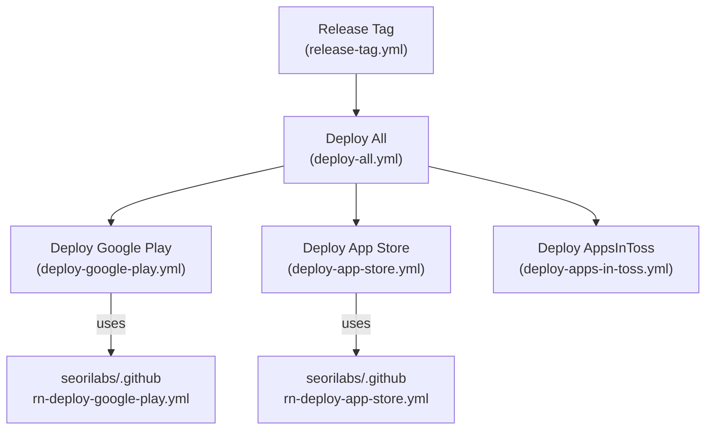

# 스토어 업로드 자동화 세팅

> **상태: 준비(gated).** `release-targets.md`의 deployment approval **미승인**. 워크플로우와 스크립트는 준비돼 있으나, 실제 업로드는 승인·시크릿·콘솔 앱이 갖춰진 뒤에만 수행한다. `main` push는 정적 게이트(static-checks)만 돌고 업로드하지 않는다.

## 파이프라인 구조

- 업로드는 명시적 `workflow_dispatch`/Release Tag에서만. `deploy-*`의 `upload` 입력이 `false`면 아티팩트만 만든다.
- Google Play 빌드·업로드: ubuntu(x64). App Store archive·업로드: macos-26. RPI ARC로 보내지 않는다.
- Google Play track 기본 `internal`. `production` 승격은 승인 후에만.

## 리포 contract 스크립트 (이 리포가 제공)

| 스크립트 | 호출 | 역할 |
| --- | --- | --- |
| `scripts/resolve-release-version.mjs` | `--tag vX.Y.Z --github-output` | SemVer → `version_name`, `android_version_code`, `apple_marketing_version`, `apple_build_number`, `release_name` 출력 |
| `scripts/upload-google-play-internal.py` | `--aab-path --release-name --release-status --track [...]` | Android Publisher API로 AAB 업로드(패키지명은 `play-store/google-play.config.json`) |
| `scripts/restore-mobile-firebase-config.mjs` | `--android\|--ios --require` | base64 env → `google-services.json` / `GoogleService-Info.plist` 복원 |

- Android gradle은 `-PversionNameOverride`/`-PversionCodeOverride`를 이미 지원(`apps/mobile/android/app/build.gradle`).

## 필요한 GitHub Secrets/Variables (이름만, 값은 커밋·출력 금지)

### Google Play (Environment: `google-play` 권장)

| 종류 | 이름 | 용도 |
| --- | --- | --- |
| var | `GOOGLE_WORKLOAD_IDENTITY_PROVIDER` | WIF provider 리소스명 |
| var | `GOOGLE_PLAY_SERVICE_ACCOUNT_EMAIL` | Play 배포 SA 이메일 |
| var | `GOOGLE_PLAY_UPLOAD_KEY_ALIAS` | 업로드 키 alias(기본 `upload`) |
| secret | `GOOGLE_PLAY_UPLOAD_KEYSTORE_BASE64` | 업로드 keystore(.jks) base64 |
| secret | `GOOGLE_PLAY_UPLOAD_KEYSTORE_PASSWORD` | keystore 비밀번호 |
| secret | `GOOGLE_PLAY_UPLOAD_KEY_PASSWORD` | 키 비밀번호(생략 시 keystore와 동일) |
| secret | `FIREBASE_ANDROID_GOOGLE_SERVICES_JSON_BASE64` | `google-services.json` base64 |

### App Store (Environment: `app-store` 권장)

| 종류 | 이름 | 용도 |
| --- | --- | --- |
| secret/var | `APPLE_TEAM_ID` | Apple Developer Team ID |
| secret | `APPLE_DISTRIBUTION_CERTIFICATE_BASE64` | Apple Distribution 인증서(.p12) base64 |
| secret | `APPLE_DISTRIBUTION_CERTIFICATE_PASSWORD` | 인증서 비밀번호 |
| secret | `APPLE_PROVISIONING_PROFILE_BASE64` | App Store provisioning profile base64 |
| secret | `APPLE_KEYCHAIN_PASSWORD` | CI 임시 keychain 비밀번호 |
| secret | `APP_STORE_CONNECT_API_KEY_ID` | ASC API Key ID |
| secret | `APP_STORE_CONNECT_ISSUER_ID` | ASC Issuer ID |
| secret | `APP_STORE_CONNECT_PRIVATE_KEY_BASE64` | ASC API `.p8` base64 |
| secret | `FIREBASE_IOS_GOOGLE_SERVICE_INFO_PLIST_BASE64` | `GoogleService-Info.plist` base64 |

## 남은 blocker

- Android release keystore 생성 + Play App Signing 등록, Play Console 앱 생성.
- Apple Distribution 인증서·App Store provisioning profile, App Store Connect 앱 생성, ASC API 키 발급.
- WIF provider·Play 배포 SA 구성(Google Play Developer API 권한 부여).
- `GoogleService-Info.plist`를 Xcode `BabyCare` 타깃 리소스에 포함(현재 project.pbxproj 미참조).
- 위 Environment 보호 규칙(required reviewers)로 실제 배포 승인 게이트 구성.
- 별도 deployment approval 전에는 `upload=true` 실행·`production` 승격 금지.
