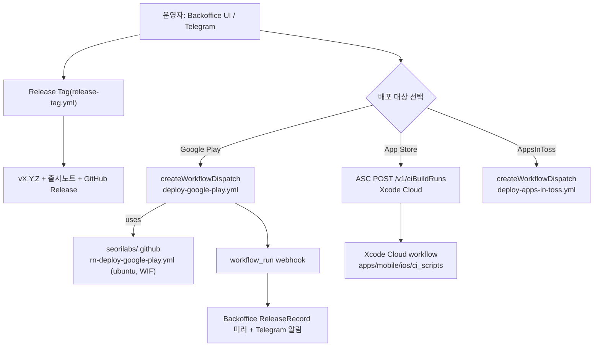

# 스토어 업로드 자동화 세팅 (백오피스 구동)

> **상태: 체계 구축 중(gated).** `release-targets.md` 의 deployment approval **미승인**.
> 워크플로우·스크립트·ci_scripts 는 준비됐고 일부 repo 설정을 주입했으나, 실제 업로드는
> 승인·서명 secret 주입·백오피스 등록·마켓별 backend(Play SA/WIF, Xcode Cloud workflow)가
> 갖춰진 뒤에만 수행한다. `main` push 는 정적 게이트(static-checks)만 돌고 업로드하지 않는다.

## 운영 진입점 = 백오피스/Telegram

배포는 `seorilabs-backoffice` 가 GitHub/App Store Connect API 로 구동한다(단방향
`API → workflow/ciBuildRuns → webhook 미러`). 앱은 **자동 발견**된다 — 백오피스 `seedRegistry()`
가 org repo 를 스캔해 `deploy-*.yml` 존재로 `marketTargets` 를, `*-store.config.json` 으로
식별자를 채운다. babycare 는 관련 파일이 모두 있어 `POST /api/admin/seed` 한 번이면
`marketTargets=["play","appstore","ait"]`, `iosBundle=com.seorilabs.babycare` 로 등록된다.

- **App Store 정본 = Xcode Cloud.** babycare 는 RNFirebase 라 Xcode 26.x 정적 링키지 회귀
  대상이라 macOS 러너 archive 실패 위험이 있어 org 이관 방향(Xcode Cloud)을 따른다.
  백오피스는 repo 가 `XCODE_CLOUD_APP_STORE_REPOS` allowlist 에 있으면 GH workflow_dispatch
  대신 ASC `ciBuildRuns` 로 트리거한다. GH `deploy-app-store.yml` 은 fallback 으로만 남긴다.
- **Google Play** 는 GH Actions(ubuntu, WIF) 경로. `deploy-google-play.yml` → org 재사용.
- 업로드는 명시적 dispatch/ciBuildRuns 에서만. `deploy-*` 의 `upload` 입력이 `false` 면 아티팩트만.

## 리포 contract (준비 완료)

| 자산 | 상태 |
| --- | --- |
| `scripts/resolve-release-version.mjs` (`--tag vX.Y.Z --github-output`) | ✅ |
| `scripts/upload-google-play-internal.py` | ✅ |
| `scripts/restore-mobile-firebase-config.mjs` (`--android`/`--ios --require`) | ✅ |
| Android gradle `-PversionNameOverride`/`-PversionCodeOverride` | ✅ |
| `apps/mobile/ios/Podfile` static framework + RNFB 혼합 링키지 | ✅ (Xcode 26 archive 전제) |
| `apps/mobile/ios/GoogleService-Info.plist` 커밋 + pbxproj 참조 (prod) | ✅ (Xcode Cloud 는 시크릿 대신 커밋본 사용) |
| `apps/mobile/ios/ci_scripts/` (ci_post_clone / ci_pre_xcodebuild) | ✅ 추가됨 |
| 워크플로우 caller (deploy-all/google-play/app-store/apps-in-toss, release-tag) | ✅ |

버전 규칙: SemVer 태그 → `versionCode/apple_build_number = major*1_000_000 + minor*1_000 + patch`
(예: v1.0.0 → `1000000`). Google Play·Xcode Cloud 모두 같은 resolver 로 산출.

## GitHub secrets / variables / environments

`secrets: inherit` 로 org+repo+environment 전달. **repo-level 값이 org-level 값을 override** 한다.

### org 레벨 (이미 존재, 공용)

- secrets: `APPS_IN_TOSS_API_KEY`, `APPLE_DISTRIBUTION_CERTIFICATE_BASE64/_PASSWORD`,
  `APPLE_KEYCHAIN_PASSWORD`, `APP_STORE_CONNECT_API_KEY_ID/_ISSUER_ID/_PRIVATE_KEY_BASE64`,
  `GOOGLE_PLAY_UPLOAD_KEYSTORE_BASE64/_PASSWORD`, `GOOGLE_PLAY_UPLOAD_KEY_PASSWORD` (private 가시성 → private repo babycare 접근 가능)
- vars: `GOOGLE_WORKLOAD_IDENTITY_PROVIDER`(ALL), `APPLE_TEAM_ID`·`GOOGLE_PLAY_UPLOAD_KEY_ALIAS`(SELECTED — babycare 미포함, 아래 repo-level 로 대체)

### repo 레벨 (babycare — per-app override)

| 종류 | 이름 | 상태 | 값/출처 |
| --- | --- | --- | --- |
| var | `GOOGLE_PLAY_UPLOAD_KEY_ALIAS` | ✅ 설정됨 | `upload` (org `seorilabs-upload` override) |
| env | `google-play`, `app-store` | ✅ 생성됨 | 보호규칙(필수 리뷰어)은 현재 요금제 미지원 → 프로세스 게이트로 유지 |
| var | `GOOGLE_PLAY_SERVICE_ACCOUNT_EMAIL` | ⏳ 대기 | babycare Play publisher SA 확정 후(예: `babycare-play-publisher@seorilabs-gws...`). WIF 바인딩·Play Console 권한 필요 |
| secret | `GOOGLE_PLAY_UPLOAD_KEYSTORE_BASE64` | ⏳ 승인 대기 | `~/.config/seorilabs/play-store/babycare-upload.jks` (babycare 전용 키, alias `upload`) |
| secret | `GOOGLE_PLAY_UPLOAD_KEYSTORE_PASSWORD` / `GOOGLE_PLAY_UPLOAD_KEY_PASSWORD` | ⏳ 승인 대기 | `apps/mobile/android/key.properties` |
| secret | `FIREBASE_ANDROID_GOOGLE_SERVICES_JSON_BASE64` | ⏳ 승인 대기 | 커밋된 prod `google-services.json` (org 워크플로우가 `--require`) |

> **주의(서명 키):** babycare Play 앱은 **전용 업로드 키**(`babycare-upload.jks`, alias `upload`)로
> 등록됐다. org 공용 keystore(alias `seorilabs-upload`)로 서명하면 Play 가 업로드를 거부한다.
> 반드시 위 repo-level 값으로 override 해야 한다.

> **App Store(Xcode Cloud)는 신규 repo secret 불필요.** 매니지드 서명 + 커밋된 plist +
> 팀 공용 ASC 키. (`APPLE_PROVISIONING_PROFILE_BASE64`·`FIREBASE_IOS_..._PLIST_BASE64` 는
> GH fallback 경로에서만 필요.)

## 남은 blocker (실제 업로드 전)

1. **Deployment approval** — 미승인. `upload=true`/production 승격 금지.
2. **서명 secret 주입** — 위 repo-level Google Play secret 4종(keystore·비번2·firebase). 값 확보됨, 주입만 승인 필요.
3. **Google Play backend** — babycare Play publisher SA 확정 + WIF 바인딩(`principalSet .../attribute.repository/seorilabs/babycare`) + Play Console API 권한. (gcloud 확인 필요)
4. **Xcode Cloud workflow(ASC 수동 1회)** — babycare 앱에 workflow 생성(workspace `apps/mobile/ios/BabyCare.xcworkspace`, scheme `BabyCare`), 매니지드 서명, **배포 준비=App Store Connect**, 시작 조건=태그 `v*.*.*`.
5. **백오피스** — `POST /api/admin/seed`(앱 자동 등록) + `k8s/deployment.yaml` 의 `XCODE_CLOUD_APP_STORE_REPOS` 에 `seorilabs/babycare` 추가 후 재배포.
6. **AppsInToss** — target 미초기화(별도 트랙).
