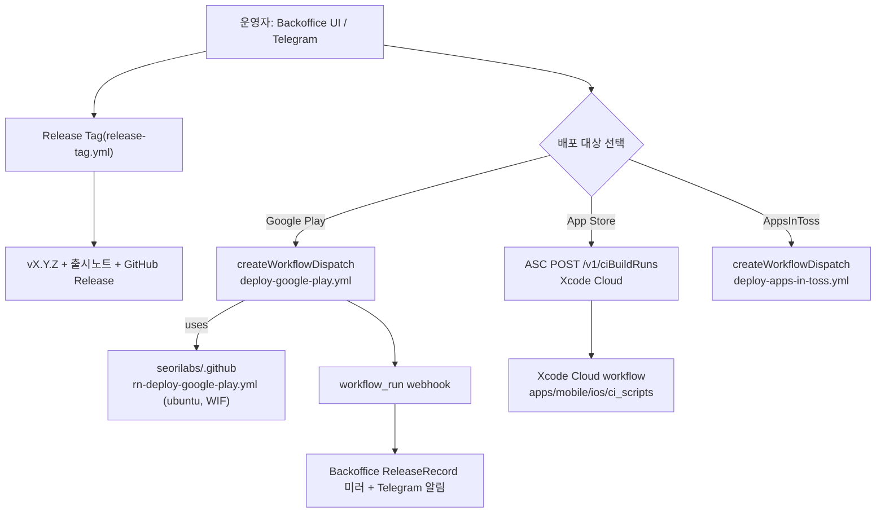

# 스토어 업로드 자동화 세팅 (백오피스 구동)

> **상태: 내부 후보 업로드 경로 구성 완료, 실제 후보 재검증 중.** 2026-08-06 사용자가
> 재배포와 남은 출시 순서 진행을 승인했다. production 승격·App Review 제출·공개 출시는
> Console 정책·법적 사업자 선택과 실기기 QA를 통과한 타깃부터 진행한다. `main` push 는
> 정적 게이트(static-checks)만 돌고 업로드하지 않는다.

## 운영 진입점 = 백오피스/Telegram

배포는 `seorilabs-backoffice` 가 GitHub/App Store Connect API 로 구동한다(단방향
`API → workflow/ciBuildRuns → webhook 미러`). 앱은 **자동 발견**된다 — 백오피스 `seedRegistry()`
가 org repo 를 스캔해 `deploy-*.yml` 존재로 `marketTargets` 를, `*-store.config.json` 으로
식별자를 채운다. babycare 는 관련 파일이 모두 있어 `POST /api/admin/seed` 한 번이면
`marketTargets=["play","appstore","ait"]`, `iosBundle=com.seorilabs.babycare` 로 등록된다.

- **App Store 정본 = Xcode Cloud.** babycare 는 RNFirebase 라 Xcode 26.x 정적 링키지 회귀
  대상이라 macOS 러너 archive 실패 위험이 있어 org 이관 방향(Xcode Cloud)을 따른다.
  백오피스는 repo 가 `XCODE_CLOUD_APP_STORE_REPOS` allowlist 에 있으면 GH workflow_dispatch
  대신 ASC `ciBuildRuns` 로 트리거한다. GH `deploy-app-store.yml` 은 fallback 으로만 남긴다.
- **Google Play** 는 GH Actions(ubuntu, WIF) 경로. `deploy-google-play.yml` → org 재사용.
- 업로드는 명시적 dispatch/ciBuildRuns 에서만. `deploy-*` 의 `upload` 입력이 `false` 면 아티팩트만.

## 리포 contract (준비 완료)

| 자산 | 상태 |
| --- | --- |
| `scripts/resolve-release-version.mjs` (`--tag vX.Y.Z --github-output`) | ✅ |
| `scripts/upload-google-play-internal.py` | ✅ |
| `scripts/restore-mobile-firebase-config.mjs` (`--android`/`--ios --require`) | ✅ |
| Android gradle `-PversionNameOverride`/`-PversionCodeOverride` | ✅ |
| `apps/mobile/ios/Podfile` static framework + RNFB 혼합 링키지 | ✅ (Xcode 26 archive 전제) |
| `apps/mobile/ios/GoogleService-Info.plist` pbxproj 참조 + Xcode Cloud secret 복원 | ✅ (파일은 커밋하지 않고 누락 시 fail-closed) |
| `apps/mobile/ios/ci_scripts/` (ci_post_clone / ci_pre_xcodebuild) | ✅ 추가됨 |
| 워크플로우 caller (deploy-all/google-play/app-store/apps-in-toss, release-tag) | ✅ |

버전 규칙: SemVer 태그 → Google Play `versionCode = major*1_000_000 + minor*1_000 + patch`
(예: v1.0.0 → `1000000`). Xcode Cloud는 같은 resolver로 marketing version을 주입하고,
`CI_BUILD_NUMBER`를 `CFBundleVersion`으로 사용한다. App Store Connect의 실제 build number를 원장에 기록한다.

## GitHub secrets / variables / environments

`secrets: inherit` 로 org+repo+environment 전달. **repo-level 값이 org-level 값을 override** 한다.

### org 레벨 (이미 존재, 공용)

- secrets: `APPS_IN_TOSS_API_KEY`, `APPLE_DISTRIBUTION_CERTIFICATE_BASE64/_PASSWORD`,
  `APPLE_KEYCHAIN_PASSWORD`, `APP_STORE_CONNECT_API_KEY_ID/_ISSUER_ID/_PRIVATE_KEY_BASE64`,
  `GOOGLE_PLAY_UPLOAD_KEYSTORE_BASE64/_PASSWORD`, `GOOGLE_PLAY_UPLOAD_KEY_PASSWORD` (private 가시성 → private repo babycare 접근 가능)
- vars: `GOOGLE_WORKLOAD_IDENTITY_PROVIDER`(ALL), `APPLE_TEAM_ID`·`GOOGLE_PLAY_UPLOAD_KEY_ALIAS`(SELECTED — babycare 미포함, 아래 repo-level 로 대체)

### repo 레벨 (babycare — per-app override)

| 종류 | 이름 | 상태 | 값/출처 |
| --- | --- | --- | --- |
| var | `GOOGLE_PLAY_UPLOAD_KEY_ALIAS` | ✅ 설정됨 | `upload` (org `seorilabs-upload` override) |
| env | `google-play`, `app-store` | ✅ 생성됨 | 보호규칙(필수 리뷰어)은 현재 요금제 미지원 → 프로세스 게이트로 유지 |
| var | `GOOGLE_PLAY_SERVICE_ACCOUNT_EMAIL` | ✅ 설정됨 | 기존 공용 `seorilabs-play-publisher@seorilabs-gws.iam.gserviceaccount.com` 사용. 새 SA 생성 금지 |
| secret | `GOOGLE_PLAY_UPLOAD_KEYSTORE_BASE64` | ✅ repo secret 설정됨 | `~/.config/seorilabs/play-store/babycare-upload.jks` (babycare 전용 키, alias `upload`) |
| secret | `GOOGLE_PLAY_UPLOAD_KEYSTORE_PASSWORD` / `GOOGLE_PLAY_UPLOAD_KEY_PASSWORD` | ✅ repo secret 설정됨 | `apps/mobile/android/key.properties` |
| secret | `FIREBASE_ANDROID_GOOGLE_SERVICES_JSON_BASE64` | ✅ repo secret 설정됨 | prod `google-services.json` (org 워크플로우가 `--require`) |

> **주의(서명 키):** babycare Play 앱은 **전용 업로드 키**(`babycare-upload.jks`, alias `upload`)로
> 등록됐다. org 공용 keystore(alias `seorilabs-upload`)로 서명하면 Play 가 업로드를 거부한다.
> 반드시 위 repo-level 값으로 override 해야 한다.

> **App Store(Xcode Cloud)는 매니지드 서명을 사용한다.** 인증서·provisioning secret은
> 불필요하지만 `FIREBASE_IOS_GOOGLE_SERVICE_INFO_PLIST_BASE64`는 Xcode Cloud secret으로
> 반드시 주입한다. 저장소에는 Firebase plist를 커밋하지 않는다.

## Google Play WIF 복구

- 2026-08-07 `seorilabs-gws`에서 `iam.googleapis.com`을 활성화하고, 공용 publisher SA의 기존 정책을 보존한 채 `principalSet://iam.googleapis.com/projects/138773558853/locations/global/workloadIdentityPools/github-actions/attribute.repository/seorilabs/babycare`에 `roles/iam.workloadIdentityUser`를 추가·readback했다.
- GitHub Actions run `31132461743`에서 GitHub OIDC 인증과 Android Publisher commit이 성공했다. AAB를 중복 업로드하지 않고 기존 `1000008`을 `internal → internal`로 재적용했으며 API readback은 `v1.0.8`/`1000008`, `completed`다. 기존 WIF impersonation blocker는 해소됐다.

## 남은 blocker

1. **백오피스** — `POST /api/admin/seed`(앱 자동 등록) + `k8s/deployment.yaml` 의 `XCODE_CLOUD_APP_STORE_REPOS` 에 `seorilabs/babycare` 추가 후 재배포.
2. **Console·QA gate** — 진행 승인은 완료. Google Play production 승격, App Review 제출, AppsInToss production release 전 국가 availability·법적 사업자·정책 설문과 실기기 QA를 완료해야 한다.
3. **AppsInToss QA** — private build sandbox 기능·실기기 QA 필요.

## 완료된 후보 readback

- **Google Play** — `v1.0.8` / `c66f7e7` AAB를 x64/JDK 21 build run `31116493641`에서 생성·서명·브랜드 icon 검증하고 internal `1.0.8`/`1000008`, `completed` 업로드를 완료했다. WIF 복구 뒤 run `31132461743`에서 동일 versionCode를 `internal → internal`로 재배포해 GitHub OIDC·Android Publisher 권한과 `v1.0.8`/`1000008`, `completed` API readback을 확인했다. production 승격은 하지 않음.
- **App Store** — `v1.0.8` Xcode Cloud run `a9c4b9b4-7c0e-4592-95ef-22039fa50962` 성공. ASC build `454e15f2-4075-4828-b613-a67085b3e7d4`에서 실제 `1.0.8`/`56`, `VALID`, `APP_STORE_ELIGIBLE`, `usesNonExemptEncryption=false` 확인. 내부 그룹 `서리랩스 내부테스터`에 build를 명시적으로 연결해 `IN_BETA_TESTING`, 테스터 2명 readback 완료.
